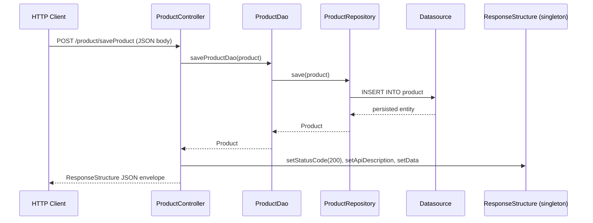
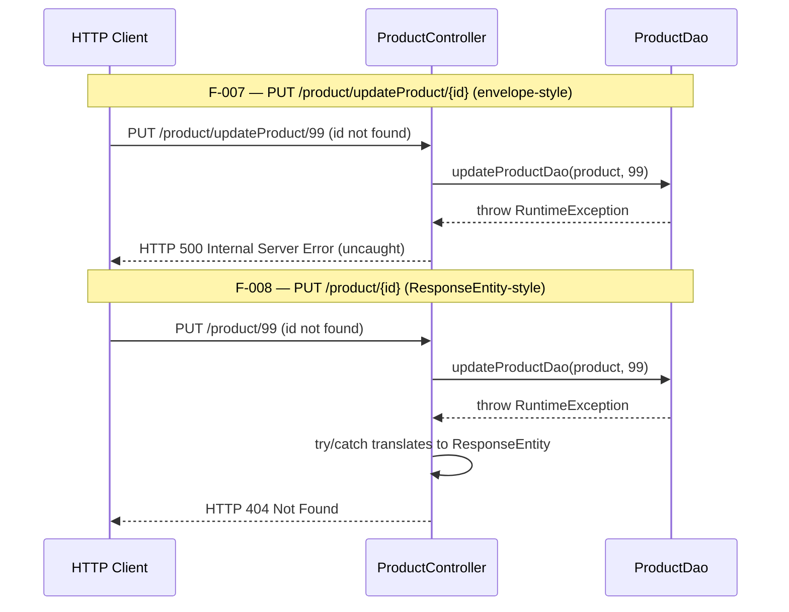
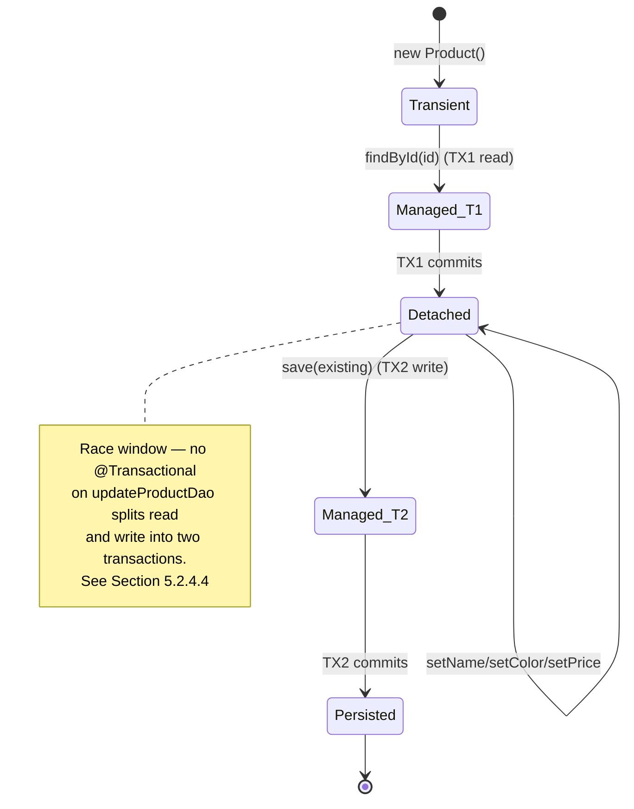

# 🛒 Product API : Spring Boot CRUD with MySQL

🚀 A robust and scalable Spring Boot-based RESTful API project designed to perform *CRUD operations on Product entities, integrated with **MySQL*, using clean architecture and modular design for better maintainability and scalability.

---

## 📑 Table of Contents

- [1. Overview](#1-overview)
- [2. Architecture](#2-architecture)
- [3. Technologies](#3-technologies)
- [4. Project Structure](#4-project-structure)
- [5. Setup Instructions](#5-setup-instructions)
- [6. Configuration Reference](#6-configuration-reference)
- [7. API Reference](#7-api-reference)
- [8. Deployment Guide](#8-deployment-guide)
- [9. Generating Javadoc HTML (Optional)](#9-generating-javadoc-html-optional)
- [10. Limitations and Known Issues](#10-limitations-and-known-issues)
- [11. Contributing / Local Development](#11-contributing--local-development)
- [12. License / Contact](#12-license--contact)

---

## 1. Overview

### 🆔 Project Identity

| Attribute | Value |
|-----------|-------|
| `groupId` | `com.jspider` |
| `artifactId` | `spring-boot-simple-crud-with-mysql` |
| `version` | `0.0.1-SNAPSHOT` |
| Spring Boot parent | `org.springframework.boot:spring-boot-starter-parent:3.4.4` |
| Java version target | `17` (declared as `<java.version>17</java.version>` in `pom.xml`) |
| Default server port | `8090` (declared in `application.properties`) |
| OpenAPI title | `Product-Crud-Operation` (per `@OpenAPIDefinition`) |
| OpenAPI version | `1.0.0` |

### 🎯 Objectives

- ✅ Develop RESTful APIs using Spring Boot
- ✅ Perform end-to-end CRUD operations with MySQL database
- ✅ Implement clean separation of concerns (Controller, DAO, Entity, Repository)
- ✅ Ensure structured project architecture following best practices
- ✅ Scalable codebase for real-time backend development and integration

This README extends those engineering objectives with the following **documentation pillars**:

- 📘 **Setup Instructions** — step-by-step prerequisites, build, and first-run smoke test (see [Section 5](#5-setup-instructions))
- 📗 **API Reference** — full per-endpoint reference for every `/product/**` and `/student/**` route (see [Section 7](#7-api-reference))
- 📙 **Deployment Guide** — JAR packaging, MySQL externalization, and single-process topology notes (see [Section 8](#8-deployment-guide))
- 📕 **Inline Code Explanations** — architecture walkthrough with diagrams and per-layer code excerpts (see [Section 2](#2-architecture))

### 👥 Stakeholders

- **Educational / onboarding consumers** — new developers learning Spring Boot CRUD with JPA against an embedded H2 fallback or a real MySQL instance.
- **Java developers** — experienced engineers using this repository as a reference for layered Spring Boot architecture (Controller → DAO → Repository → Entity).
- **Code reviewers** — readers who want to inspect deliberate pedagogical patterns such as the two-style update duplication between `PUT /product/updateProduct/{id}` and `PUT /product/{id}`.

*Source: Section 1.1 — Executive Summary*

---

## 2. Architecture

The application is a layered Spring Boot monolith. Inbound HTTP requests are received by the embedded Tomcat container on port `8090`, dispatched to the relevant controller, which delegates to the DAO, which in turn delegates to a Spring Data JPA repository proxy, which uses Hibernate to persist against the configured datasource.

### 🏗️ Layered Topology

```mermaid
graph TD
    Client[HTTP Client]
    Tomcat[Embedded Tomcat :8090]
    PC[ProductController<br/>/product]
    SC[StudentController<br/>/student]
    PD[ProductDao<br/>@Repository]
    PR[ProductRepository<br/>JpaRepository]
    Hibernate[Hibernate / JPA]
    DS[(H2 in-memory<br/>or MySQL)]
    Swagger[Swagger UI<br/>/swagger-ui/**]

    Client -->|HTTP/JSON| Tomcat
    Tomcat --> PC
    Tomcat --> SC
    Tomcat --> Swagger
    PC --> PD
    PD --> PR
    PR --> Hibernate
    Hibernate --> DS
```

The flow is **Controller → DAO → Repository → JPA → Datasource**. Note one deliberate design choice: there is no separate "service" tier between the controller and the persistence layer. The class named `ProductDao` is annotated `@Repository` but acts as a hybrid service-and-DAO layer. This conflation is explicit and pedagogical — there is no business-logic transformation between the controller's `productDao.saveProductDao(product)` call and the `productRepository.save(product)` call inside the DAO.

### 🔁 Request Flow — `saveProduct` Success Path (F-001)



The `responseStructure` field on `ProductController` is **autowired as a `@Component`-scoped singleton**. Every request handler that uses it (currently `saveProductController` and `updateProductController`) mutates the same shared instance via `setStatusCode`, `setApiDescription`, and `setData`. Under concurrent traffic this opens a field-aliasing window — see [Section 10 — Limitations and Known Issues](#10-limitations-and-known-issues).

### 🔀 Update Style Contrast — F-007 vs F-008



The controller deliberately exposes **two different update endpoints** that share the same underlying DAO call but expose different error contracts:

- **F-007 — `PUT /product/updateProduct/{id}`** returns the project's `ResponseStructure<Product>` envelope on success. On failure (e.g., the supplied `id` does not exist), the `RuntimeException` thrown by `ProductDao.updateProductDao(...)` propagates uncaught and the framework returns **HTTP 500 Internal Server Error**.
- **F-008 — `PUT /product/{id}`** returns a `ResponseEntity<Product>`. The handler wraps the DAO call in a `try { ... } catch (RuntimeException e) { ... }` block and translates a missing id into **HTTP 404 Not Found**.

This duplication is intentional — it is a pedagogical demonstration of two REST error-handling styles in the same controller.

### 🔄 JPA Entity Lifecycle (with detached-state race window)



`ProductDao.updateProductDao(Product product, Integer id)` is **not** annotated `@Transactional`. The `findById(id)` read happens in transaction TX1 and the `save(existingProduct)` write happens in transaction TX2. Between TX1 commit (when the entity becomes detached) and TX2 begin (when the save is invoked), another writer can update the same row — producing a **lost-update** outcome where the in-flight client overwrites a concurrent change. This race is documented in [Section 10 — Limitations and Known Issues](#10-limitations-and-known-issues).

### 📜 Inline Code Walkthrough

The five code excerpts below trace a complete request through every architectural layer of the application: Controller, DAO, Repository, Entity, Envelope. Each excerpt is taken **verbatim** from the source file referenced.

#### Layer 1 — Controller

*Source: [ProductController.java](src/main/java/com/jspider/spring_boot_simple_crud_with_mysql/controller/ProductController.java)*

```java
@PostMapping(value = "/saveProduct")
@Operation(description = "it will save one object at a time",
responses = {
        @ApiResponse(responseCode = "200", description = "Product saved successfully"),
        @ApiResponse(responseCode = "400", description = "Invalid input, object not saved"),
        @ApiResponse(responseCode = "406", description = "Not acceptable, validation failed"),
        @ApiResponse(responseCode = "500", description = "Internal server error") }
)
public ResponseStructure<Product> saveProductController(@RequestBody Product product) {
    System.out.println(product);

    Product product2 = productDao.saveProductDao(product);

    if (product2 != null) {
        responseStructure.setStatusCode(HttpStatus.OK.value());
        responseStructure.setApiDescription("save product Secessfully...");
        responseStructure.setData(product2);
        return responseStructure;
    } else {
        responseStructure.setStatusCode(HttpStatus.NOT_ACCEPTABLE.value());
        responseStructure.setApiDescription("data not saved something went wrong");
        responseStructure.setData(product2);
        return responseStructure;
    }
}
```

The controller method delegates persistence to `productDao.saveProductDao(product)`, then mutates the autowired singleton `responseStructure` envelope and returns it directly. The branch logic distinguishes a successful save (`HTTP 200`) from a perceived failure (`HTTP 406 Not Acceptable`). The `@ApiResponse` annotations declare four response codes for Swagger UI rendering. The `apiDescription` strings (including the literal spelling "save product Secessfully...") are reproduced verbatim from the source.

#### Layer 2 — DAO

*Source: [ProductDao.java](src/main/java/com/jspider/spring_boot_simple_crud_with_mysql/dao/ProductDao.java)*

```java
public Product updateProductDao(Product product, Integer id) {
    Optional<Product> optional = productRepository.findById(id);

    if (optional.isPresent()) {
        Product existingProduct = optional.get();

        // Do NOT update the ID; it should remain unchanged
        existingProduct.setName(product.getName());
        existingProduct.setColor(product.getColor());
        existingProduct.setPrice(product.getPrice());

        return productRepository.save(existingProduct);
    } else {
        // You can handle not found case as you wish
        throw new RuntimeException("Product not found with ID: " + id);
    }
}
```

This DAO method illustrates the **split-transaction race window**:

1. `productRepository.findById(id)` opens transaction **TX1**, reads the row, and commits — the returned entity is now **detached**.
2. The detached entity is mutated in-memory via `setName`, `setColor`, and `setPrice`.
3. `productRepository.save(existingProduct)` opens transaction **TX2** and writes the mutated copy back.

Because there is no class-level or method-level `@Transactional` annotation on `ProductDao` or on `updateProductDao(...)`, the two transactions are independent. A concurrent writer can mutate the same row between TX1 and TX2, and that change is silently overwritten when TX2 commits. In the missing-id branch, the method throws an unchecked `RuntimeException` that propagates back to the calling controller — F-007 lets it propagate to HTTP 500; F-008 catches it and translates to HTTP 404.

#### Layer 3 — Repository

*Source: [ProductRepository.java](src/main/java/com/jspider/spring_boot_simple_crud_with_mysql/repository/ProductRepository.java)*

```java
public interface ProductRepository extends JpaRepository<Product, Integer> {

    List<Product> findByName(String name);

    @Query(value = "select * from product where price=?", nativeQuery = true)
    List<Product> getProductByPrice(double price);

    @Query(value = "delete from product where price=?", nativeQuery = true)
    @Modifying
    @Transactional
    void deleteProductByPrice(double price);
}
```

`ProductRepository` extends `JpaRepository<Product, Integer>`, which Spring Data JPA proxies at runtime to provide `save`, `findAll`, `findById`, `deleteById`, `saveAll`, and ~16 other inherited methods.

The interface declares three additional methods:

- **`findByName(String)`** — a **derived query**: Spring Data JPA parses the method name `findByName` and auto-generates `SELECT p FROM Product p WHERE p.name = :name`. No JPQL or SQL is written by hand.
- **`getProductByPrice(double)`** — a **native SQL query** declared via `@Query(... nativeQuery = true)`. The literal SQL is `select * from product where price=?` and uses positional binding.
- **`deleteProductByPrice(double)`** — a **modifying native query**. The triple `@Modifying` + `@Transactional` + `@Query` is mandatory because (a) `@Modifying` tells Spring Data JPA to treat the query as DML rather than SELECT, and (b) `@Transactional` opens the transaction needed for DML (Spring Data JPA requires a transaction for any modifying query). **This is the only `@Transactional` boundary in the entire codebase.**

Note: `org.springframework.data.jpa.repository.NativeQuery` is imported in this file but **not used** anywhere. The `nativeQuery = true` attribute on `@Query` is what activates native SQL — the `NativeQuery` annotation import is dead code.

#### Layer 4 — Entity

*Source: [Product.java](src/main/java/com/jspider/spring_boot_simple_crud_with_mysql/entity/Product.java)*

```java
@Entity
@Data
@Schema(name = "product class", description = "this is product entity class")
public class Product {

    @Id
    private int id;
    private String name;
    private String color;
    @Schema(description = "price datatype is double")

    private double price;
}
```

The entity is a straightforward JPA-managed type:

- `@Entity` — JPA managed; mapped to a table named `product` (default mapping).
- `@Data` (Lombok) — generates getters, setters, `equals`, `hashCode`, `toString`, and a no-arg constructor at compile time.
- `@Schema` — supplies Swagger UI metadata (note the literal class-name string `"product class"` declared in the annotation).

**Critical observation:** the `@Id` field is declared **without** `@GeneratedValue`. Callers MUST therefore supply a unique `id` value in every `POST /product/saveProduct` request. The endpoint is **non-idempotent at the contract level** — sending the same payload twice with the same `id` will cause a primary-key violation rather than auto-incrementing. There is also **no** `@Version` field on the entity, so JPA performs no optimistic-locking detection of concurrent updates.

#### Layer 5 — Response Envelope

*Source: [ResponseStructure.java](src/main/java/com/jspider/spring_boot_simple_crud_with_mysql/responses/ResponseStructure.java)*

```java
@Data
@Component
@Schema(hidden = true)
public class ResponseStructure<T> {

    private int statusCode;
    private String apiDescription;
    private T data;
}
```

`ResponseStructure<T>` is a generic envelope used by the two endpoints that return structured responses (`POST /product/saveProduct` and `PUT /product/updateProduct/{id}`). The annotation triple is:

- `@Data` (Lombok) — generates getters/setters for `statusCode`, `apiDescription`, and `data`.
- `@Component` — registers the class as a Spring bean with **default singleton scope**.
- `@Schema(hidden = true)` — instructs Springdoc OpenAPI to omit this class from the schema list at `/v3/api-docs`.

**Critical observation:** because `@Component` produces a singleton, the `responseStructure` field autowired into `ProductController` is **the same instance across every request**. Every call to `setStatusCode(...)`, `setApiDescription(...)`, and `setData(...)` mutates that shared instance. Under concurrent traffic the fields can be aliased across in-flight requests, producing wrong response payloads. Recommended remediation (out of scope for this documentation effort) is to make `ResponseStructure` per-request-instantiated (e.g., remove `@Component` and `new` it in each handler) or to declare it `@Scope("prototype")`.

*Source: Section 5.1 — High-Level Architecture; Section 5.2 — Component Details*

---

## 3. Technologies

The exact versions cited below match `pom.xml` and the Maven Wrapper distribution. **No "latest" placeholders are used.**

| Technology | Version | Purpose |
|------------|---------|---------|
| Java | **17 LTS** | Runtime / compile target (declared `<java.version>17</java.version>` in `pom.xml`) |
| Spring Boot | **3.4.4** | Application framework (parent POM `org.springframework.boot:spring-boot-starter-parent:3.4.4`) |
| Spring Data JPA | (BOM-managed by Spring Boot 3.4.4) | ORM via `spring-boot-starter-data-jpa` |
| Spring Web | (BOM-managed by Spring Boot 3.4.4) | REST endpoints via `spring-boot-starter-web` |
| Spring Boot DevTools | (BOM-managed) | Optional dev-time hot reload (`runtime` scope, `<optional>true</optional>`) |
| Spring Boot Test | (BOM-managed) | Test framework via `spring-boot-starter-test` (`test` scope) |
| H2 Database | (BOM-managed) | In-memory runtime fallback datasource (`runtime` scope) |
| MySQL Connector/J | (BOM-managed) | MySQL driver (`runtime` scope) |
| Lombok | (BOM-managed) | `@Data` boilerplate reduction (annotation processor; `<optional>true</optional>`) |
| Springdoc OpenAPI | **2.8.6** | Swagger UI + OpenAPI 3 schema (the only explicitly version-pinned dependency in `pom.xml`) |
| Maven Wrapper | **3.3.2** | Reproducible build via `./mvnw` / `mvnw.cmd` |
| Apache Tomcat | (BOM-managed; embedded) | Servlet container (port `8090` per `application.properties`) |
| Hibernate ORM | (BOM-managed by Spring Data JPA) | JPA implementation under the hood |
| HikariCP | (BOM-managed) | JDBC connection pool (default `maximum-pool-size=10`) |

The IDE used during development can be Eclipse IDE or IntelliJ IDEA, and Postman is recommended for ad-hoc API exercise. Git/GitHub is the version-control system of record.

*Source: Section 3.1 — Programming Languages; Section 3.2 — Frameworks & Libraries; pom.xml*

---

## 4. Project Structure

The corrected and audited tree of the substantive project root (`EP-Spring-Boot--main/`):

```text
EP-Spring-Boot--main/
├── README.md                                         # This file
├── pom.xml                                           # Maven build descriptor
├── mvnw                                              # Maven Wrapper (POSIX)
├── mvnw.cmd                                          # Maven Wrapper (Windows)
├── .mvn/
│   └── wrapper/
│       └── maven-wrapper.properties                  # Maven Wrapper distributionUrl pin (required by mvnw)
├── bin/                                              # Eclipse build mirror (generated; out of scope)
└── src/
    ├── main/
    │   ├── java/com/jspider/spring_boot_simple_crud_with_mysql/
    │   │   ├── SpringBootSimpleCrudWithMysqlApplication.java   # JVM entry point; @OpenAPIDefinition
    │   │   ├── controller/
    │   │   │   ├── ProductController.java            # 10 REST handlers under /product
    │   │   │   └── StudentController.java            # 2 auxiliary handlers under /student
    │   │   ├── dao/
    │   │   │   └── ProductDao.java                   # @Repository service+DAO conflation
    │   │   ├── entity/
    │   │   │   └── Product.java                      # JPA @Entity (id, name, color, price)
    │   │   ├── repository/
    │   │   │   └── ProductRepository.java            # extends JpaRepository<Product, Integer>
    │   │   └── responses/
    │   │       └── ResponseStructure.java            # @Component generic envelope (statusCode, apiDescription, data)
    │   └── resources/
    │       └── application.properties                # 2 keys: spring.application.name, server.port=8090
    └── test/
        └── java/com/jspider/spring_boot_simple_crud_with_mysql/
            └── SpringBootSimpleCrudWithMysqlApplicationTests.java   # Lone @SpringBootTest with empty contextLoads()
```

Notes:

- All paths use forward slashes for cross-platform portability.
- The `.mvn/wrapper/maven-wrapper.properties` file pins the Apache Maven distribution URL consumed by the `mvnw` / `mvnw.cmd` scripts. **This file is required for the Maven Wrapper to function** — without it, `./mvnw` cannot resolve the Maven distribution to download. Its single content line is `distributionUrl=https://repo.maven.apache.org/maven2/org/apache/maven/apache-maven/3.9.9/apache-maven-3.9.9-bin.zip`. If the file is ever lost, regenerate it with `mvn -N wrapper:wrapper -Dmaven=3.9.9` from any system Maven installation, or copy it from a reference checkout.
- The `bin/` folder is a generated Eclipse build mirror; it contains compiled `*.class` files plus copies of source. It is **generated**, not authored, and is out of scope for documentation purposes.
- There is **no** `static/` or `templates/` directory; the project is API-only and serves no HTML/Thymeleaf views.
- There is **no** `HELP.md` file (the Spring Initializr default has been removed).

The Eclipse Project Structure as visualized in the IDE (preserved screenshots from prior versions of this README):


*Source: Repository inventory; Section 7.1.2.1*

---

## 5. Setup Instructions

### 🔧 Prerequisites

- **Java 17 LTS** — OpenJDK 17.x or any compatible distribution. Verify with `java -version` and `javac -version`.
- **Network access** — required on first build to download the Maven Wrapper distribution and Maven Central artifacts.
- **Git** — required to clone the repository.
- **(Optional) MySQL 8.x** — required only if you choose to run against MySQL instead of the default H2 in-memory datasource.

### 📥 Clone and Build

```bash
git clone <repository-url>
cd EP-Spring-Boot--main
./mvnw clean compile        # Compile sanity check
./mvnw clean package        # Build executable JAR
```

The first `./mvnw` invocation downloads the pinned Maven distribution into `~/.m2/wrapper/` and resolves all dependencies from Maven Central.

On Windows command prompt, replace `./mvnw` with `mvnw.cmd`:

```bash
mvnw.cmd clean package
```

### 🟢 Run with H2 (Default)

The shipped `application.properties` declares **no** `spring.datasource.*` keys. Spring Boot's auto-configuration therefore falls back to the **H2 in-memory** datasource at `jdbc:h2:mem:testdb` with user `sa` and an empty password:

```bash
./mvnw spring-boot:run
```

Expected console output (abbreviated):

```text
Started SpringBootSimpleCrudWithMysqlApplication in X.XXX seconds (process running for X.XXX)
All Right Sudhir...........
```

The `All Right Sudhir...........` line is emitted by `SpringBootSimpleCrudWithMysqlApplication.main(...)` after `SpringApplication.run(...)` returns. The application binds the embedded Tomcat to port `8090`.

### 🔵 Run with MySQL (Externalized)

To target a real MySQL database, supply the standard Spring Boot externalization keys at runtime. Three equivalent forms are accepted:

**Form 1 — command-line arguments:**

```bash
java -jar target/spring-boot-simple-crud-with-mysql-0.0.1-SNAPSHOT.jar \
  --spring.datasource.url=jdbc:mysql://localhost:3306/products_db \
  --spring.datasource.username=root \
  --spring.datasource.password=secret \
  --spring.jpa.hibernate.ddl-auto=update
```

**Form 2 — environment variables:**

```bash
export SPRING_DATASOURCE_URL=jdbc:mysql://localhost:3306/products_db
export SPRING_DATASOURCE_USERNAME=root
export SPRING_DATASOURCE_PASSWORD=secret
export SPRING_JPA_HIBERNATE_DDL_AUTO=update
java -jar target/spring-boot-simple-crud-with-mysql-0.0.1-SNAPSHOT.jar
```

**Form 3 — external properties file:**

```bash
java -jar target/spring-boot-simple-crud-with-mysql-0.0.1-SNAPSHOT.jar \
  --spring.config.import=optional:file:./mysql.properties
```

Where `mysql.properties` contains:

```properties
spring.datasource.url=jdbc:mysql://localhost:3306/products_db
spring.datasource.username=root
spring.datasource.password=secret
spring.jpa.hibernate.ddl-auto=update
```

The `mysql-connector-j` JDBC driver is already declared as a `runtime`-scoped dependency in `pom.xml`, so no additional driver installation is required.

### 🧪 First-Run Smoke Test

After the application starts on port `8090`, exercise the most trivial endpoint to confirm the server is responsive:

```bash
curl http://localhost:8090/product/getTodayDate
# Expected: an ISO-formatted current date with a trailing space, e.g., "2026-04-30 "
```

For a fuller smoke test, persist a product and read it back:

```bash
# Create
curl -X POST http://localhost:8090/product/saveProduct \
  -H "Content-Type: application/json" \
  -d '{"id": 1, "name": "Pen", "color": "Blue", "price": 25.0}'

# Read
curl http://localhost:8090/product/getProduct/1

# List all
curl http://localhost:8090/product/findAllProduct
```

Open the **Swagger UI** at [http://localhost:8090/swagger-ui/index.html](http://localhost:8090/swagger-ui/index.html) for an interactive exploration of every endpoint.

*Source: Section 8.8 — Minimal Build and Distribution Requirements; Section 8.9.3*

---

## 6. Configuration Reference

### 📄 `application.properties` Keys (declared)

The shipped properties file at `src/main/resources/application.properties` declares only two keys:

| Key | Value | Purpose |
|-----|-------|---------|
| `spring.application.name` | `spring-boot-simple-crud-with-mysql` | Application name (used in logging, Actuator endpoints if added) |
| `server.port` | `8090` | Embedded Tomcat bind port |

In raw form:

```properties
spring.application.name=spring-boot-simple-crud-with-mysql

server.port=8090
```

### 🔌 Externalized Properties (for MySQL)

The following keys are **NOT** declared in `application.properties`. The deliberate absence allows Spring Boot to fall back to H2 in-memory by default. Operators must supply these at runtime when targeting MySQL:

| Key | Default (when unset) | Purpose |
|-----|----------------------|---------|
| `spring.datasource.url` | (unset → H2 fallback `jdbc:h2:mem:testdb`) | JDBC URL |
| `spring.datasource.username` | (unset → `sa` for H2) | Datasource user |
| `spring.datasource.password` | (unset → empty for H2) | Datasource password |
| `spring.datasource.driver-class-name` | (unset → auto-detected from URL) | Optional explicit driver class name |
| `spring.jpa.hibernate.ddl-auto` | (unset → Hibernate default depends on driver) | Schema lifecycle (`none`, `validate`, `update`, `create`, `create-drop`) |
| `spring.jpa.show-sql` | `false` | Whether to log generated SQL |
| `spring.h2.console.enabled` | `false` | Whether to expose the H2 web console at `/h2-console` |
| `logging.level.root` | `INFO` | Root logger level |
| `logging.level.org.hibernate.SQL` | `INFO` | SQL log level |

### 💧 HikariCP Defaults (auto-configured by Spring Boot)

HikariCP is the default JDBC connection pool. Spring Boot configures it with sensible defaults:

| Property | Default | Source |
|----------|---------|--------|
| `spring.datasource.hikari.maximum-pool-size` | `10` | Spring Boot auto-configuration |
| `spring.datasource.hikari.minimum-idle` | `10` (mirrors max) | Spring Boot auto-configuration |
| `spring.datasource.hikari.connection-timeout` | `30000` ms | HikariCP default |
| `spring.datasource.hikari.idle-timeout` | `600000` ms (10 minutes) | HikariCP default |
| `spring.datasource.hikari.max-lifetime` | `1800000` ms (30 minutes) | HikariCP default |

### 🐱 Embedded Tomcat Defaults

| Property | Value / Default | Source |
|----------|-----------------|--------|
| Bind port | `8090` | Declared in `application.properties` |
| `server.tomcat.threads.max` | `200` | Spring Boot auto-configuration |
| `server.tomcat.threads.min-spare` | `10` | Spring Boot auto-configuration |
| `server.tomcat.connection-timeout` | `20000` ms | Spring Boot auto-configuration |
| `server.servlet.context-path` | `/` (root) | No context path is declared |

### 📚 Springdoc OpenAPI (auto-configured)

The presence of `org.springdoc:springdoc-openapi-starter-webmvc-ui:2.8.6` activates the following surfaces with no further configuration:

| Surface | URL | Purpose |
|---------|-----|---------|
| Swagger UI | `http://localhost:8090/swagger-ui/index.html` | Interactive HTML rendering of the API |
| OpenAPI 3 JSON | `http://localhost:8090/v3/api-docs` | Raw OpenAPI 3 schema for tooling |
| OpenAPI 3 YAML | `http://localhost:8090/v3/api-docs.yaml` | YAML variant of the schema |

There are **no** profile-specific properties files (no `application-dev.properties`, `application-mysql.properties`, etc.). The single shipped properties file is used for all environments unless externalized via the forms shown in [Section 5](#5-setup-instructions).

*Source: Section 8.8.4; Section 8.9.3; Section 8.9.4 — HikariCP Connection Pool; Section 8.9.5 — Embedded Tomcat*

---

## 7. API Reference

> **Important base-path correction:** earlier README versions documented endpoints under `/products` (plural). The actual controller declares `@RequestMapping(value = "/product")` (singular), per [ProductController.java](src/main/java/com/jspider/spring_boot_simple_crud_with_mysql/controller/ProductController.java) line 28. **All endpoints below use the singular `/product` base path.**

The application exposes **12 endpoints** in total: 10 under `/product/**` (handled by `ProductController`) and 2 under `/student/**` (handled by `StudentController`). All endpoints are unsecured — there is no authentication, authorization, or rate-limiting layer.

### 📦 `/product` Endpoints (10) — `ProductController`

#### **F-010** `GET /product/getTodayDate` — Today's Date

| Attribute | Value |
|-----------|-------|
| HTTP verb | `GET` |
| Path | `/product/getTodayDate` |
| Request body | (none) |
| Path variables | (none) |
| Response type | `String` |
| Status codes | `200` (default) |

Returns the current server date in ISO format with a trailing space, e.g., `"2026-04-30 "`.

```http
GET /product/getTodayDate HTTP/1.1
Host: localhost:8090
```

Response:

```http
HTTP/1.1 200 OK
Content-Type: text/plain;charset=UTF-8

2026-04-30 
```

#### **F-001** `POST /product/saveProduct` — Create Single Product

| Attribute | Value |
|-----------|-------|
| HTTP verb | `POST` |
| Path | `/product/saveProduct` |
| Request body | `Product` JSON |
| Response type | `ResponseStructure<Product>` |
| Declared `@ApiResponse` codes | `200`, `400`, `406`, `500` |

The full `@ApiResponse` declarations (from source):

- `200 — Product saved successfully`
- `400 — Invalid input, object not saved`
- `406 — Not acceptable, validation failed`
- `500 — Internal server error`

> **Caller responsibility:** because the `Product.id` field is declared `@Id` **without** `@GeneratedValue`, the caller MUST supply a unique `id` value with each request. Sending a duplicate `id` causes a primary-key violation. See [Section 10 — Limitations and Known Issues](#10-limitations-and-known-issues).

Example request:

```http
POST /product/saveProduct HTTP/1.1
Host: localhost:8090
Content-Type: application/json

{"id": 1, "name": "Pen", "color": "Blue", "price": 25.0}
```

Example response:

```json
{
  "statusCode": 200,
  "apiDescription": "save product Secessfully...",
  "data": {"id": 1, "name": "Pen", "color": "Blue", "price": 25.0}
}
```

> Note: the literal string `"save product Secessfully..."` (with the spelling as shown) is the actual `apiDescription` value emitted by the controller. It is reproduced verbatim.

#### **F-002** `POST /product/saveProducts` — Bulk Create

| Attribute | Value |
|-----------|-------|
| HTTP verb | `POST` |
| Path | `/product/saveProducts` |
| Request body | `List<Product>` JSON array |
| Response type | `List<Product>` |
| Status codes | `200` (default) |

Persists multiple products in a single call. Returns the list of persisted entities.

```http
POST /product/saveProducts HTTP/1.1
Host: localhost:8090
Content-Type: application/json

[
  {"id": 10, "name": "Pen",    "color": "Blue", "price": 25.0},
  {"id": 11, "name": "Pencil", "color": "HB",   "price":  5.0}
]
```

#### **F-003** `GET /product/findAllProduct` — List All

| Attribute | Value |
|-----------|-------|
| HTTP verb | `GET` |
| Path | `/product/findAllProduct` |
| Response type | `List<Product>` |
| Status codes | `200` (default) |

Returns every persisted product. **No pagination, sorting, or filtering** is supported by this endpoint — the full table is returned in a single response.

```http
GET /product/findAllProduct HTTP/1.1
Host: localhost:8090
```

#### **F-004** `GET /product/getProduct/{id}` — Get By ID

| Attribute | Value |
|-----------|-------|
| HTTP verb | `GET` |
| Path | `/product/getProduct/{id}` |
| Path variable | `id` (Integer) |
| Response type | `Product` or `null` |
| Status codes | `200` (default; even on miss — returns `null` body) |

> **Note:** on miss, the underlying DAO returns `null` (via `optional.isPresent() ? optional.get() : null`). The controller does not translate that to HTTP 404 — the response is HTTP 200 with `null` body. This is a known divergence from typical REST conventions.

```http
GET /product/getProduct/1 HTTP/1.1
Host: localhost:8090
```

#### **F-005** `GET /product/getProductByName/{name}` — Get By Name

| Attribute | Value |
|-----------|-------|
| HTTP verb | `GET` |
| Path | `/product/getProductByName/{name}` |
| Path variable | `name` (String) |
| Response type | `List<Product>` |
| Status codes | `200` (default) |

Implemented via the Spring Data JPA derived query `findByName(String)` on `ProductRepository`. The match is exact-equality (`WHERE name = :name`).

```http
GET /product/getProductByName/Pen HTTP/1.1
Host: localhost:8090
```

#### **F-006** `GET /product/getProductByPrice/{price}` — Get By Price

| Attribute | Value |
|-----------|-------|
| HTTP verb | `GET` |
| Path | `/product/getProductByPrice/{price}` |
| Path variable | `price` (double) |
| Response type | `List<Product>` |
| Status codes | `200` (default) |

Implemented via the **native SQL query** `select * from product where price=?` on `ProductRepository.getProductByPrice(double)`.

```http
GET /product/getProductByPrice/25.0 HTTP/1.1
Host: localhost:8090
```

#### **F-009** `DELETE /product/deleteProductByPrice/{price}` — Delete By Price

| Attribute | Value |
|-----------|-------|
| HTTP verb | `DELETE` |
| Path | `/product/deleteProductByPrice/{price}` |
| Path variable | `price` (double) |
| Response type | `void` |
| Status codes | `200` (default) |

Implemented via the **modifying native SQL query** `delete from product where price=?` on `ProductRepository.deleteProductByPrice(double)`. The repository method is annotated with the triple `@Modifying` + `@Transactional` + `@Query` — **the only `@Transactional` boundary in the entire codebase**.

```http
DELETE /product/deleteProductByPrice/25.0 HTTP/1.1
Host: localhost:8090
```

#### **F-007** `PUT /product/updateProduct/{id}` — Update (envelope-style)

| Attribute | Value |
|-----------|-------|
| HTTP verb | `PUT` |
| Path | `/product/updateProduct/{id}` |
| Path variable | `id` (Integer) |
| Request body | `Product` JSON |
| Response type | `ResponseStructure<Product>` |
| Declared `@ApiResponse` codes | `200`, `400`, `406`, `500` |

The full `@ApiResponse` declarations (from source):

- `200 — Product Update successfully`
- `400 — Invalid input, object not saved`
- `406 — Not acceptable, validation failed`
- `500 — Internal server error`

> **CRITICAL behavior — HTTP 500 on missing id:** if the supplied `id` does not exist in the database, `ProductDao.updateProductDao(...)` throws `RuntimeException("Product not found with ID: " + id)`. The controller does **not** catch this exception, so it propagates uncaught and the framework returns **HTTP 500 Internal Server Error**. This is the deliberate envelope-style contract; contrast with F-008 below.

Example request:

```http
PUT /product/updateProduct/1 HTTP/1.1
Host: localhost:8090
Content-Type: application/json

{"id": 1, "name": "Updated Pen", "color": "Red", "price": 30.0}
```

Example success response:

```json
{
  "statusCode": 200,
  "apiDescription": "update product Secessfully...",
  "data": {"id": 1, "name": "Updated Pen", "color": "Red", "price": 30.0}
}
```

#### **F-008** `PUT /product/{id}` — Update (ResponseEntity-style)

| Attribute | Value |
|-----------|-------|
| HTTP verb | `PUT` |
| Path | `/product/{id}` |
| Path variable | `id` (Integer) |
| Request body | `Product` JSON |
| Response type | `ResponseEntity<Product>` |
| Status codes | `200` on success, `404` on missing id |

> **CRITICAL behavior — HTTP 404 on missing id:** the handler wraps the DAO call in `try { ... } catch (RuntimeException e) { ... }` and translates a `RuntimeException` (the missing-id signal) into `new ResponseEntity<>(HttpStatus.NOT_FOUND)`. This is a **deliberate contrast with F-007** — same DAO call, different error contract. Both endpoints exist on purpose to demonstrate two REST error-handling styles.

Example request:

```http
PUT /product/1 HTTP/1.1
Host: localhost:8090
Content-Type: application/json

{"id": 1, "name": "Updated Pen", "color": "Red", "price": 30.0}
```

Example success response:

```http
HTTP/1.1 200 OK
Content-Type: application/json

{"id": 1, "name": "Updated Pen", "color": "Red", "price": 30.0}
```

Example missing-id response:

```http
HTTP/1.1 404 Not Found
```

### 🎓 `/student` Endpoints (2) — `StudentController`

> **Note:** `StudentController` is an auxiliary/demonstration controller. Unlike `ProductController`, it is **not** annotated with `@CrossOrigin` and **not** annotated with Swagger's `@Tag`. As a result, its endpoints appear in Swagger UI under the controller's bean name with no custom grouping or description.

#### **F-011** `GET /student/getTodayDate` — Today's Date (auxiliary)

| Attribute | Value |
|-----------|-------|
| HTTP verb | `GET` |
| Path | `/student/getTodayDate` |
| Response type | `String` |
| Status codes | `200` (default) |

Identical implementation to F-010 (`GET /product/getTodayDate`) — returns `LocalDate.now() + " "` (ISO date with trailing space).

```http
GET /student/getTodayDate HTTP/1.1
Host: localhost:8090
```

#### **F-012** `POST /student/addition/{a1}/{b1}` — Integer Addition

| Attribute | Value |
|-----------|-------|
| HTTP verb | `POST` |
| Path | `/student/addition/{a1}/{b1}` |
| Path variables | `a1` (int), `b1` (int) |
| Response type | `int` |
| Status codes | `200` (default) |

Returns the integer sum `a1 + b1`. **No overflow handling** — arithmetic uses Java `int` semantics, so `addition(2147483647, 1)` will silently wrap around to `-2147483648`.

Example request:

```http
POST /student/addition/3/5 HTTP/1.1
Host: localhost:8090
```

Example response:

```http
HTTP/1.1 200 OK
Content-Type: text/plain;charset=UTF-8

8
```

### 📦 Response Envelope — `ResponseStructure<T>`

Two endpoints (F-001 `POST /product/saveProduct` and F-007 `PUT /product/updateProduct/{id}`) return the project's custom envelope. Other endpoints return raw payloads.

The envelope JSON shape is:

```json
{
  "statusCode": 200,
  "apiDescription": "save product Secessfully...",
  "data": { "...generic-typed payload..." }
}
```

| Field | Type | Purpose |
|-------|------|---------|
| `statusCode` | `int` | Numeric HTTP-style status code mirrored from `HttpStatus.X.value()` |
| `apiDescription` | `String` | Free-form human-readable description |
| `data` | `T` (generic) | Generic-typed payload — `Product` for the two product endpoints |

The class is annotated `@Schema(hidden = true)`, so it does **not** appear in the OpenAPI schema list at `/v3/api-docs`. The envelope is implemented by [ResponseStructure.java](src/main/java/com/jspider/spring_boot_simple_crud_with_mysql/responses/ResponseStructure.java).

### 📑 Swagger UI / OpenAPI Cross-Reference

When the application is running on `localhost:8090`:

- **Interactive Swagger UI** — [http://localhost:8090/swagger-ui/index.html](http://localhost:8090/swagger-ui/index.html)
- **Raw OpenAPI 3 JSON** — [http://localhost:8090/v3/api-docs](http://localhost:8090/v3/api-docs)
- **Raw OpenAPI 3 YAML** — [http://localhost:8090/v3/api-docs.yaml](http://localhost:8090/v3/api-docs.yaml)

The declared OpenAPI metadata (per `@OpenAPIDefinition` in [SpringBootSimpleCrudWithMysqlApplication.java](src/main/java/com/jspider/spring_boot_simple_crud_with_mysql/SpringBootSimpleCrudWithMysqlApplication.java)) — **quoted verbatim** from the source:

| Field | Value (verbatim) |
|-------|------------------|
| Title | `"Product-Crud-Operation"` |
| Version | `"1.0.0"` |
| Description | `"we perform crud operartion with mysql db"` *(the spelling `operartion` is preserved verbatim as declared in the source — this README does not "fix" declared metadata)* |
| Contact name | `""` (empty) |
| Contact email | `""` (empty) |
| Contact URL | `"https://www.w3schools.com/"` |

📌 Sample API Test (Postman):


*Source: Section 5.2.2.1 — REST Controller Inventory; Section 2.1 — Feature Catalog (F-001..F-012); Section 7.3.1.1 — Swagger UI; Section 7.3.2.1 — OpenAPI Annotations*

---

## 8. Deployment Guide

### 📦 Build the Executable JAR

```bash
cd EP-Spring-Boot--main
./mvnw clean package
# Produces: target/spring-boot-simple-crud-with-mysql-0.0.1-SNAPSHOT.jar
```

The Maven Wrapper (`./mvnw`) is the canonical invocation — never use a system-installed `mvn`. The wrapper guarantees the same Maven version (`3.3.2`) is used everywhere, regardless of what is installed on the operator's machine.

The produced JAR is a Spring-Boot-repackaged executable: it contains the application's compiled classes, all Maven runtime dependencies (Tomcat, Hibernate, HikariCP, Springdoc, MySQL driver, H2 driver), and a Spring Boot launcher (`org.springframework.boot.loader.launch.JarLauncher`) as the JAR entry point.

The JAR coordinate is:

```text
com.jspider:spring-boot-simple-crud-with-mysql:0.0.1-SNAPSHOT
```

### 🚀 Run the JAR

```bash
java -jar target/spring-boot-simple-crud-with-mysql-0.0.1-SNAPSHOT.jar
```

Expected console output (abbreviated):

```text
Started SpringBootSimpleCrudWithMysqlApplication in X.XXX seconds
All Right Sudhir...........
```

The embedded Tomcat binds to port `8090` (declared in `application.properties`). Override at launch with `--server.port=NNNN` or with the environment variable `SERVER_PORT=NNNN`.

For production-like detached operation:

```bash
nohup java -jar target/spring-boot-simple-crud-with-mysql-0.0.1-SNAPSHOT.jar > app.log 2>&1 &
echo $! > app.pid
```

### 🏗️ Single-Process Topology

This application runs as a **single-process JVM** — one Tomcat container, one JDBC connection pool, one in-memory or remote datasource. The repository contains no artifacts that imply otherwise:

- **No CI/CD pipeline** — there is no `.github/workflows/`, no `Jenkinsfile`, no `.gitlab-ci.yml`, no `.circleci/config.yml`, and no `azure-pipelines.yml` in the repository. CI/CD is **not applicable** to this project as shipped.
- **No containerization** — there is no `Dockerfile`, no `docker-compose.yml`, no `.dockerignore`. Containerization is **not applicable** as shipped.
- **No orchestration** — there is no Helm chart, no Kubernetes manifest (`*.yaml` deployment/service files), no Kustomize overlay. Orchestration is **not applicable** as shipped.
- **No load balancer / clustering** — the application is a single JVM bound to one host:port pair. Horizontal scaling, load balancing, and distributed session state are out of scope.
- **No reverse proxy** — there is no NGINX or Apache HTTPD configuration. Operators are responsible for placing a reverse proxy in front of this JVM if they need TLS termination, request rewriting, or static-asset serving.

Operators who require any of the above must add the relevant artifacts themselves; this README does **not** make claims about deployment topologies that are absent from the codebase.

### 🐬 Externalize the Datasource for MySQL

Identical to the configuration shown in [Section 5: Setup Instructions — Run with MySQL (Externalized)](#5-setup-instructions). The same command-line arguments, environment variables, or external properties files apply at deployment time. For production deployments:

- **Prefer environment-variable injection** (Form 2 in Section 5). Most container runtimes and PaaS providers support per-deployment environment variables natively.
- **Never commit credentials to the repository.** The `application.properties` file in this project deliberately declares no `spring.datasource.password` — keep it that way.
- **Mount a per-environment properties file** (Form 3 in Section 5) when you need a richer configuration profile — e.g., `application-prod.properties` mounted as a Kubernetes ConfigMap, or `mysql.properties` placed alongside the JAR by your deployment automation.

Example minimum production-style invocation:

```bash
SPRING_DATASOURCE_URL=jdbc:mysql://prod-db.example.com:3306/products_db \
SPRING_DATASOURCE_USERNAME=prod_user \
SPRING_DATASOURCE_PASSWORD="$(cat /run/secrets/mysql_password)" \
SPRING_JPA_HIBERNATE_DDL_AUTO=validate \
java -jar spring-boot-simple-crud-with-mysql-0.0.1-SNAPSHOT.jar
```

(Note `SPRING_JPA_HIBERNATE_DDL_AUTO=validate` for production — `update` is convenient for development but should not be used against a production schema.)

*Source: Section 8.8.5 — Executable JAR; Section 8.9.1 — Topology; Section 8.9.3 — Datasource Externalization; Section 8.4 — Containerization N/A; Section 8.5 — Orchestration N/A; Section 8.6 — CI/CD N/A*

---

## 9. Generating Javadoc HTML (Optional)

The Java source files in this project carry Javadoc on every public type, method, and field. Two pathways are available for rendering that Javadoc to browsable HTML.

### Pathway A — With `maven-javadoc-plugin` Declared (Recommended)

If `pom.xml` declares the `org.apache.maven.plugins:maven-javadoc-plugin:3.11.2` plugin, generate Javadoc with:

```bash
./mvnw javadoc:javadoc
# Output: target/reports/apidocs/index.html
```

> **Note on output location**: Maven Javadoc Plugin **3.10.0** and later (which includes `3.11.2` declared in this project's `pom.xml`) emits the rendered HTML under `${project.build.directory}/reports/apidocs/` (i.e., `target/reports/apidocs/`) rather than the historical `target/site/apidocs/` location used by plugin versions ≤ 3.8.0. This change was introduced by issue [MJAVADOC-813](https://issues.apache.org/jira/browse/MJAVADOC-813). To restore the legacy `target/site/apidocs/` path, declare `<reportOutputDirectory>${project.build.directory}/site</reportOutputDirectory>` inside the plugin's `<configuration>` block in `pom.xml`.

To produce a Javadoc JAR alongside the application JAR (useful for publishing to a Maven repository):

```bash
./mvnw javadoc:jar
# Output: target/spring-boot-simple-crud-with-mysql-0.0.1-SNAPSHOT-javadoc.jar
```

### Pathway B — Ad-Hoc (Without Plugin Declaration)

If the plugin is not declared in `pom.xml`, Maven still resolves it implicitly on first invocation:

```bash
./mvnw javadoc:javadoc
# Same output as above; Maven downloads the plugin on first invocation
```

For an aggregate Javadoc tree (degenerate to a single module here):

```bash
./mvnw javadoc:aggregate
# Aggregate output: target/reports/apidocs/
```

Open `target/reports/apidocs/index.html` in any browser.

*Source: Documentation Tooling Dependencies; Maven Javadoc Plugin coordinates on Maven Central*

---

## 10. Limitations and Known Issues

This project is intentionally simple and **production-grade hardening is out of scope**. The following limitations are documented as-is so that future readers and operators are aware of them. Each issue cites the technical specification section that informed it.

### 🏎️ Race window in `ProductDao.updateProductDao`

[ProductDao.java](src/main/java/com/jspider/spring_boot_simple_crud_with_mysql/dao/ProductDao.java) — the `updateProductDao(Product, Integer)` method has **no `@Transactional` annotation**. The `findById(id)` read happens in transaction TX1, and the subsequent `save(existingProduct)` write happens in transaction TX2. Between TX1 commit and TX2 begin, another writer can update the same row, and that change is silently overwritten when TX2 commits. This is a classic **lost-update** scenario.

*Source: Section 5.2.4.4*

### 🔁 `ResponseStructure<T>` field-aliasing under concurrent traffic

[ResponseStructure.java](src/main/java/com/jspider/spring_boot_simple_crud_with_mysql/responses/ResponseStructure.java) — the envelope class is annotated `@Component`, meaning Spring instantiates it as a **singleton** and injects the same instance into `ProductController`. Each request handler that uses the envelope mutates this shared instance via `setStatusCode`, `setApiDescription`, and `setData`. Under concurrent requests, fields can alias across in-flight requests, producing wrong response payloads (e.g., one client receives another client's `data`).

Recommended (out-of-scope) remediation: declare `@Scope("prototype")` on the bean, or remove `@Component` and `new` it inside each handler.

*Source: Section 5.2.6.4*

### 🆔 Missing `@GeneratedValue` on `Product.id`

[Product.java](src/main/java/com/jspider/spring_boot_simple_crud_with_mysql/entity/Product.java) — the `@Id` field is declared **without** a `@GeneratedValue` strategy. Callers MUST therefore supply unique `id` values explicitly with every `POST /product/saveProduct` request. The endpoint is **non-idempotent at the contract level** — a duplicate `id` causes a primary-key violation rather than auto-generating a fresh key.

*Source: Section 5.2.5.2*

### 🔢 Missing `@Version` on `Product`

[Product.java](src/main/java/com/jspider/spring_boot_simple_crud_with_mysql/entity/Product.java) — the entity has **no `@Version` field**, so JPA performs no optimistic locking. Concurrent updates to the same row may overwrite each other silently with no `OptimisticLockException` thrown.

*Source: Section 5.2.5.3*

### 🛑 No global exception handler

There is **no** `@RestControllerAdvice` and **no** `@ExceptionHandler` anywhere in the project. Runtime exceptions in F-007 (`PUT /product/updateProduct/{id}`) propagate uncaught and the framework returns HTTP 500 by default. F-008 (`PUT /product/{id}`) catches its own `RuntimeException` locally with a try/catch. There is no project-wide error envelope, no error code taxonomy, and no structured error logging.

*Source: Section 5.2.8.2*

### 🧪 Trivial test coverage

The only test in the project is `SpringBootSimpleCrudWithMysqlApplicationTests.contextLoads()`, which has an empty body. It validates **only** that the Spring application context can boot — there are no controller tests, DAO tests, integration tests, or contract tests. CI gating on this test catches catastrophic configuration errors but nothing more.

*Source: Section 6.6.1*

### 🚫 No CI/CD, containerization, or orchestration

The repository contains no `Dockerfile`, no `docker-compose.yml`, no Helm chart, no Kubernetes manifest, no GitHub Actions workflow, no Jenkinsfile, and no GitLab CI configuration. Documenting these is therefore out of scope — see [Section 8 — Deployment Guide](#8-deployment-guide) for the full enumeration.

*Source: Section 8.4; Section 8.5; Section 8.6*

### 🪪 No security layer

There is no Spring Security dependency, no authentication filter, no authorization annotation, no TLS configuration, and no rate-limiter. The `@CrossOrigin(value = "")` on `ProductController` is a permissive CORS declaration. Operators deploying this application to any non-trivial environment must add a security layer themselves.

*Source: Repository inspection — no `spring-boot-starter-security` dependency in `pom.xml`*

### 🗒️ Outer-wrapper stub files

The repository contains two non-functional placeholder files at an inner-wrapper level (`ProductRepository.java` containing only `cvfv` and `application.properties` containing only `cdvfbgr`). These are clearly stubs and are **out of scope** for documentation purposes.

*Source: Section 1.2.1*

### 🧱 `bin/**` is a generated Eclipse build mirror

The `bin/` directory at the project root is created by the Eclipse IDE during incremental compilation. It contains compiled `*.class` files plus copies of the source. It is **generated**, not authored, and must be ignored from a documentation standpoint. Removing the directory has no effect on `./mvnw clean compile` or `./mvnw clean package`.

*Source: Section 7.1.2.1*

### 🪝 Unused import in `ProductRepository`

[ProductRepository.java](src/main/java/com/jspider/spring_boot_simple_crud_with_mysql/repository/ProductRepository.java) imports `org.springframework.data.jpa.repository.NativeQuery` but does not use it anywhere — `nativeQuery = true` is supplied as an attribute on `@Query`, not via the `@NativeQuery` annotation. The unused import is harmless but noteworthy.

*Source: Section 5.2.4*

*Source: Section 5.2.4.4; Section 5.2.5.2; Section 5.2.5.3; Section 5.2.6.4; Section 5.2.8.2; Section 1.2.1; Section 7.1.2.1*

---

## 11. Contributing / Local Development

- **Always use the Maven Wrapper.** Use `./mvnw` (or `mvnw.cmd` on Windows) for every build/test/run invocation. **Never** run a system-installed `mvn` binary — the wrapper guarantees a reproducible Maven version (`3.3.2`) across all developer machines.

- **Run the smoke test before opening a pull request.** The single existing test validates Spring context bootability:

  ```bash
  ./mvnw clean test
  ```

  This executes `contextLoads()` in [SpringBootSimpleCrudWithMysqlApplicationTests.java](src/test/java/com/jspider/spring_boot_simple_crud_with_mysql/SpringBootSimpleCrudWithMysqlApplicationTests.java).

- **Documentation contributions live in this single `README.md`.** The repository deliberately avoids a `docs/` tree — all narrative documentation should be added here as new sections or sub-sections. Keep the existing 12-section ordering intact. Add `## N. New Section` only at the end, after Section 12, and update the Table of Contents.

- **Code-level contributions go in Javadoc.** Every public type, method, and field carries Javadoc. Maintain that 100% Javadoc coverage when adding new code. Use `@param`, `@return`, `@throws`, and `{@link}` cross-references per JDK conventions.

- **Preserve declared metadata verbatim.** Do not "fix" the spelling `operartion` in the OpenAPI description, do not change the contact URL, do not silently rename the `apiDescription` strings such as `"save product Secessfully..."`. These are part of the project's existing OpenAPI/response contract.

- **Style:** match the existing 4-space indentation in Java sources and the 2-space indentation in markdown.

- **Pull requests:** describe the change in plain English, link the affected `## N. Section` of this README if the change has a documentation impact, and attach a smoke-test transcript.

*Source: Section 6.6.1 — Testing Strategy; Section 8.8.1 — Maven Wrapper*

---

## 12. License / Contact

**License:** No `LICENSE` file is present in this repository as of the current snapshot. Add one per your organization's policy before public distribution. Common choices for educational Spring Boot examples are MIT, Apache-2.0, or BSD-3-Clause.

**Contact:** see project-level GitHub issues for bug reports, feature requests, and questions. The OpenAPI metadata declares a contact URL of `"https://www.w3schools.com/"` (preserved verbatim from the source — this is the educational reference point declared by the original author and is **not** the maintainer's contact).

**Project author identity:** the artifact `groupId` is `com.jspider`, suggesting the project originated as part of a J-Spider Software Solutions training cohort.

*Source: Repository contact metadata; pom.xml*

---
