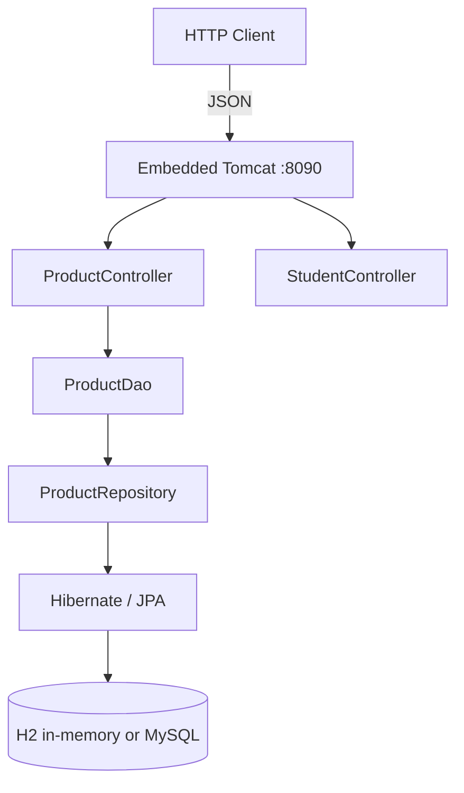

# Technical Specification

# 0. Agent Action Plan

## 0.1 Intent Clarification

### 0.1.1 Core Documentation Objective

Based on the provided requirements, the Blitzy platform understands that the documentation objective is to **add comprehensive code-level API documentation to the server-side source files** of the `EP-Spring-Boot--main` project, and to **rewrite the project's `README.md` into a comprehensive operator-and-developer guide** that includes setup instructions, an API reference, a deployment guide, and inline code explanations of the application's architecture.

| Categorization Dimension | Determined Value |
|--------------------------|------------------|
| Request Category | **Update existing documentation** (the `README.md` at `EP-Spring-Boot--main/README.md` exists and must be expanded) **and Create new documentation** (code-level Javadoc currently absent on every Java source file) |
| Primary Documentation Type | **API docs** (Javadoc on Java classes/methods) + **README file** (project root markdown) |
| Secondary Documentation Type | **User guides** (setup, deployment) + **Architecture / inline code explanations** (embedded in README and Javadoc) |
| Output Surface | Javadoc HTML (optional, build-time) and a single comprehensive `README.md` |

### 0.1.2 CRITICAL — User Request Versus Repository Reality

The user-supplied request literally states: *"Add JSDoc comments to server.js functions, create a comprehensive README with setup instructions, API documentation, deployment guide, and inline code explanations."*

The user-supplied rule (under the rule key `QA-30-Apr-rules`) literally states: *"npm create"*.

A complete repository inspection confirms the following technical reality, which is in direct conflict with the JavaScript-oriented terminology in the user's request:

| User-Stated Element | Repository Reality | Resolution Adopted |
|---------------------|--------------------|--------------------|
| `server.js` (Node.js source file) | **Does not exist anywhere in the repository.** The repository contains zero `*.js`, `*.ts`, `*.jsx`, or `*.tsx` files; no `package.json`, `package-lock.json`, or `node_modules/`; no Node.js toolchain. The complete inbound surface is realized in Java per Section 7.1.2.1 ("`*.tsx`, `*.jsx`, `*.vue`, `*.svelte` files: 0 matches in repository"). | **Map to the equivalent Java server source set.** The "server" in this codebase is the seven Java source files under `EP-Spring-Boot--main/src/main/java/com/jspider/spring_boot_simple_crud_with_mysql/`, with `SpringBootSimpleCrudWithMysqlApplication.java` serving as the single JVM entry point analogous to a Node.js `server.js`. |
| `JSDoc` (JavaScript documentation comment format) | **Not applicable.** There is no JavaScript code to annotate. The project is Java 17 per Section 3.1.1.1, with the persistence layer using the `jakarta.persistence` namespace and Spring Boot 3.4.4 per Section 3.2.1.1. | **Substitute Javadoc**, the JDK-bundled equivalent for Java. Javadoc is the conventional documentation format for Spring Boot codebases and integrates with the existing `org.springdoc:springdoc-openapi-starter-webmvc-ui:2.8.6` annotations already present in the source. |
| `npm create` rule | **Not applicable.** Per Section 7.1.2.2, *"Any Node.js / npm artifact"* is absent from the dependency graph. The build tool is Apache Maven invoked through the `mvnw` / `mvnw.cmd` Maven Wrapper scripts per Section 8.8.1. | **Acknowledge as user-provided but inapplicable to a Maven-based Java project.** No `npm` invocation can be added because no Node.js runtime, `package.json`, or npm registry dependency exists. The rule is recorded verbatim in Section 0.10 and superseded by the Maven Wrapper invocations native to this project. |

The Blitzy platform interprets the user's intent as fundamentally about **documentation** (the noun) rather than the **specific filenames or tooling** mentioned (which appear to be drawn from generic JavaScript-project terminology). The platform proceeds by realizing the documentation intent against the actual Java/Maven artefacts present in the repository.

### 0.1.3 Special Instructions and Constraints (Verbatim Capture)

The user's complete request is preserved verbatim below for traceability:

> **User Request:** "Add JSDoc comments to server.js functions, create a comprehensive README with setup instructions, API documentation, deployment guide, and inline code explanations."

> **User-Specified Rule (`QA-30-Apr-rules`):** "npm create"

The four documentation pillars enumerated by the user are extracted with crystal clarity below; each pillar is mapped to its concrete artifact in Section 0.5:

- Pillar A — **Code-level documentation** ("JSDoc comments to server.js functions") → Javadoc on every public type, public method, public field, and significant private member of all seven Java source files in `src/main/java/com/jspider/spring_boot_simple_crud_with_mysql/**`.
- Pillar B — **Setup instructions** in the README → step-by-step prerequisites (Java 17 JDK, MySQL or H2 datasource), Maven Wrapper invocation, environment variables, and first-run validation.
- Pillar C — **API documentation** in the README → consolidated reference for the ten `/product/**` endpoints and two `/student/**` endpoints documented in Section 5.2.2.1, with HTTP verb, path, request schema, response schema, status codes, and example payloads.
- Pillar D — **Deployment guide** in the README → packaging into the Spring-Boot-repackaged executable JAR (per Section 8.8.5), runtime invocation (`java -jar ...`), datasource externalization for MySQL, and the absence-of-orchestration caveat per Section 8.9.1.
- Pillar E — **Inline code explanations** ("inline code explanations") → an architecture narrative in the README that walks the reader through the layered control flow (Controller → DAO → Repository → Entity → Database) and reproduces select code excerpts with explanatory prose.

No user-supplied template is in effect; no example documentation snippets were supplied; no tone or formatting directives beyond the four pillars were specified. The existing `README.md` style (emoji-prefixed headings, table-based feature lists) is preserved and extended rather than replaced.

### 0.1.4 Technical Interpretation

These documentation requirements translate to the following technical documentation strategy:

- To realize Pillar A (code-level documentation), Javadoc comment blocks (`/** ... */`) will be added immediately above each type declaration, public method, and significant field across all seven Java source files; comments will document the type's role in the layered architecture, every parameter (`@param`), every return value (`@return`), and every thrown exception (`@throws`) for methods that throw, with cross-references (`{@link}`) to collaborating types.
- To realize Pillar B (setup instructions), a new "Setup Instructions" / "Getting Started" section will be authored in the README enumerating Java 17 installation, repository cloning, datasource configuration (defaulting to H2 in-memory but with explicit MySQL externalization steps mirroring Section 8.9.3), Maven Wrapper invocation (`./mvnw spring-boot:run` for development, `./mvnw clean package` for distribution), and a curl-based smoke test against port 8090.
- To realize Pillar C (API documentation), a new "API Reference" section will replace the current single endpoint table with a per-endpoint subsection containing path, verb, request body schema (referencing `Product` fields per Section 5.2.5), response envelope (referencing `ResponseStructure<T>` per Section 5.2.6), declared status codes (200/400/406/500 from `@ApiResponse` annotations per Section 5.2.2.1), and Swagger UI cross-reference (`/swagger-ui/index.html` per Section 7.3.1.1).
- To realize Pillar D (deployment guide), a new "Deployment" section will document the executable JAR workflow per Section 8.8.5, datasource externalization for MySQL deployments, port 8090 exposure, the single-process topology limitation per Section 8.9.1, and the absence of containerization/orchestration per Sections 8.4–8.7.
- To realize Pillar E (inline code explanations), a new "Architecture" section will embed a Mermaid component diagram (sourced from Section 1.2.2.2) and a Mermaid sequence diagram (sourced from Section 5.2.8.1) and walk through select code excerpts from `ProductController` and `ProductDao` with paragraph-level explanation of the layered handoffs and the deliberate response-style duplication between F-007 and F-008.

### 0.1.5 Inferred Documentation Needs

Based on a complete repository code analysis and on the existing technical specification, the following additional documentation needs are inferred and incorporated into the plan:

- Based on code analysis: `ProductController` exposes ten public REST methods documented in Section 5.2.2.1, only **two** of which (`saveProduct`, `updateProduct/{id}`) currently carry `@Operation`/`@ApiResponse` annotations; the remaining eight methods, plus all of `StudentController`, are publicly addressable but have no developer-facing documentation surface. Javadoc on these methods is required to close this gap.
- Based on structure: The deliberate two-style update duplication between F-007 (`PUT /product/updateProduct/{id}`, envelope-style, propagates `RuntimeException` to HTTP 500) and F-008 (`PUT /product/{id}`, `ResponseEntity`-style, translates absence to HTTP 404) per Section 5.2.8.2 is a pedagogical signal that must be called out explicitly in both the Javadoc on the two methods and the architecture narrative of the README.
- Based on dependencies: The `springdoc-openapi-starter-webmvc-ui:2.8.6` library auto-generates Swagger UI at `/swagger-ui/**` per Section 7.3.1.1; the README must cross-reference this surface so that human readers can pivot from the static markdown reference to the live interactive surface.
- Based on user journey: A first-time consumer of this repository must be able to (a) clone it, (b) run it locally with zero external dependencies (using H2 by default), and (c) exercise an endpoint within minutes; the setup section must therefore explicitly state the H2-default behavior governed by Section 8.9.3 ("`application.properties` declares no `spring.datasource.*` keys → H2 in-memory at `jdbc:h2:mem:testdb`").
- Based on configuration: The shipped `application.properties` declares only `spring.application.name` and `server.port=8090` per Section 8.8.4; the absence of `spring.datasource.*`, `spring.jpa.hibernate.ddl-auto`, and `logging.*` properties is itself a documentation-worthy fact and must be surfaced in the deployment guide so that operators know which knobs are missing.
- Based on absence-evidence: The `bin/` directory is an Eclipse build mirror per Section 7.1.2.1 (containing `*.class` files and copies of source) and is **not** a project-authored deliverable; the README's documentation must clarify that `EP-Spring-Boot--main/bin/**` is generated and ignored from a documentation standpoint.

## 0.2 Documentation Discovery and Analysis

### 0.2.1 Existing Documentation Infrastructure Assessment

A comprehensive repository scan was performed to enumerate every documentation artifact present prior to executing this plan. The assessment is summarized below.

**Documentation files discovered:**

| Path | Size | Purpose | Status |
|------|------|---------|--------|
| `README.md` (repo root, outer wrapper) | small | Stub README at the outer `15-Apr-java-existing-projects-qa-test-main/` wrapper | Out of scope — stub at non-substantive wrapper directory |
| `EP-Spring-Boot--main/README.md` | 5,111 bytes | Project README: Objectives, Project Structure tree, Technologies, Key Features, API Endpoints table, sample API test image, duplicated "API Automation Framework" section | **In scope — primary update target** |
| `EP-Spring-Boot--main/HELP.md` (if present per Spring Initializr convention) | — | Auto-generated by Spring Initializr, references docs.spring.io | Verified absent in directory listing |
| `*.md` outside the two above | — | None found | — |
| `*.adoc`, `*.rst`, `*.mdx` | — | None found | — |
| `docs/` directory at any depth | — | Not present | — |
| `wiki/` directory | — | Not present | — |

**Documentation generators / configuration:**

| Tool | Configuration File | Status |
|------|-------------------|--------|
| MkDocs | `mkdocs.yml` | Not present |
| Docusaurus | `docusaurus.config.js` | Not present |
| Sphinx | `conf.py`, `docs/source/` | Not present |
| Read the Docs | `.readthedocs.yml` | Not present |
| Antora | `antora.yml` | Not present |
| Jekyll/Hugo | `_config.yml`, `config.toml` | Not present |
| Maven Javadoc Plugin | `<plugin>` block in `pom.xml` | **Not currently declared** — only `maven-compiler-plugin` and `spring-boot-maven-plugin` are declared per Section 3.6.1.5 |
| Springdoc OpenAPI | `springdoc-openapi-starter-webmvc-ui:2.8.6` in `pom.xml` | **Present** — auto-renders Swagger UI at `/swagger-ui/**` per Section 7.3.1.1 |

**Documentation-related annotations already in the source tree** (per Section 7.3.2):

- `@OpenAPIDefinition` + `@Info` + `@Contact` on `SpringBootSimpleCrudWithMysqlApplication` declare the API metadata: title `"Product-Crud-Operation"`, version `"1.0.0"`, description `"we perform crud operartion with mysql db"` (verbatim including the typo), contact URL `"https://www.w3schools.com/"`.
- `@Tag(name = "Product-controller", description = "perform CRUD operation in DB")` and `@Operation` / `@ApiResponse` on the `saveProduct` and `updateProduct` methods of `ProductController`.
- `@Schema` annotations on every field of `Product` and on the `price` field with explanation `"Price always Greater than 0"`.
- `@Schema(hidden = true)` on `ResponseStructure<T>` to suppress its appearance in the OpenAPI schema list.
- `StudentController` carries **zero** Swagger annotations — confirmed gap.
- Plain Javadoc comment blocks (`/** ... */`) are **absent** from every Java source file in the project. The project ships with **zero** Javadoc coverage.

**Diagram tools detected:** None. No Mermaid, PlantUML, GraphViz, or `*.puml` files exist in the repository. Mermaid-rendered diagrams are part of the technical specification narrative only and do not currently exist in the repository's documentation files.

**Documentation hosting / deployment setup:** None. There is no GitHub Pages workflow, no `gh-pages` branch reference in `.github/workflows/**` (no GitHub Actions directory exists), no Read the Docs configuration, and no Maven `site` lifecycle binding.

### 0.2.2 Existing README.md Content Audit

The existing `EP-Spring-Boot--main/README.md` is a 5,111-byte markdown file with the following structure (sections enumerated by current heading order):

| Existing Section | Coverage Quality | Gap to Address |
|------------------|------------------|----------------|
| Title `🛒 Product API : Spring Boot CRUD with MySQL` | Adequate | Preserve verbatim |
| Objectives | Brief — covers the educational goal | Extend to enumerate the four documentation pillars introduced by this plan |
| Project Structure Overview | Tree diagram | Verify accuracy against actual file tree; expand with per-directory description |
| Technologies Used | List (Java 17, Spring Boot, Spring Data JPA, MySQL, Maven, IDE, Postman, Git/GitHub) | Add explicit versions (Spring Boot **3.4.4**, Springdoc **2.8.6**, Java **17 LTS**) per Section 3.2.1 |
| Key Features | Bullet list | Reconcile with the 18-feature catalog of Section 2.1.1 |
| API Endpoints | Single condensed table covering POST/GET/PUT/DELETE on `/products` | **Critically inaccurate** — actual base path is `/product` (singular) per Section 5.2.2.1, not `/products`; only ten of the twelve endpoints are listed; envelope-style versus `ResponseEntity`-style PUT distinction is absent |
| Sample API test image | Postman screenshot | Preserve as visual aid |
| Duplicated "API Automation Framework" section | Appears to be a paste-in from an unrelated project | **Remove or relocate** — it does not describe this project's automation, and there are no test framework files matching its claim (the only test file is `SpringBootSimpleCrudWithMysqlApplicationTests.java` with a single empty `contextLoads()` per Section 6.6.1) |
| Setup Instructions section | **Absent** | **CREATE** — covers Java 17 install, Maven Wrapper invocation, datasource configuration, first-run smoke test |
| Deployment Guide section | **Absent** | **CREATE** — covers JAR packaging, runtime invocation, MySQL externalization, port 8090, single-process topology |
| Inline Code Explanations / Architecture | **Absent** | **CREATE** — Mermaid component diagram, sequence diagram, paragraph walkthroughs |
| Configuration Reference | **Absent** | **CREATE** — table of every property in `application.properties` plus documented externalization keys |
| Swagger UI cross-reference | **Absent** | **CREATE** — link to `/swagger-ui/index.html` and `/v3/api-docs` |
| Build Outputs section | **Absent** | **CREATE** — mention `target/spring-boot-simple-crud-with-mysql-0.0.1-SNAPSHOT.jar` and `bin/` Eclipse mirror caveat |

### 0.2.3 Repository Code Analysis for Documentation

The complete inventory of Java source files requiring Javadoc is as follows. All paths are relative to `EP-Spring-Boot--main/`.

| Source File | Type Stereotype | Public Members Requiring Javadoc | Current Javadoc Coverage |
|-------------|-----------------|----------------------------------|--------------------------|
| `src/main/java/com/jspider/spring_boot_simple_crud_with_mysql/SpringBootSimpleCrudWithMysqlApplication.java` | `@SpringBootApplication`, JVM entry point | class, `main(String[] args)` | **0%** |
| `src/main/java/com/jspider/spring_boot_simple_crud_with_mysql/controller/ProductController.java` | `@RestController @RequestMapping("/product")` | class, 10 handler methods, 2 autowired fields | **0%** Javadoc; partial Swagger annotations on 2 of 10 methods |
| `src/main/java/com/jspider/spring_boot_simple_crud_with_mysql/controller/StudentController.java` | `@RestController @RequestMapping("/student")` | class, 2 handler methods | **0%** |
| `src/main/java/com/jspider/spring_boot_simple_crud_with_mysql/dao/ProductDao.java` | `@Repository` | class, 8 service-style methods, 1 autowired field | **0%** |
| `src/main/java/com/jspider/spring_boot_simple_crud_with_mysql/entity/Product.java` | `@Entity @Data @Schema` | class, 4 fields | **0%** Javadoc; `@Schema` on `price` field only |
| `src/main/java/com/jspider/spring_boot_simple_crud_with_mysql/repository/ProductRepository.java` | `JpaRepository<Product, Integer>` interface | interface, 3 declared methods | **0%** |
| `src/main/java/com/jspider/spring_boot_simple_crud_with_mysql/responses/ResponseStructure.java` | `@Data @Component @Schema(hidden = true)` | class, 3 fields | **0%** Javadoc; `@Schema(hidden = true)` only |
| `src/test/java/com/jspider/spring_boot_simple_crud_with_mysql/SpringBootSimpleCrudWithMysqlApplicationTests.java` | `@SpringBootTest` | class, 1 method `contextLoads()` | **0%** |

**Configuration and build files inspected:**

- `pom.xml` — Build descriptor; documents groupId `com.jspider`, artifactId `spring-boot-simple-crud-with-mysql`, version `0.0.1-SNAPSHOT`, Spring Boot parent `3.4.4`, Java 17, dependency list, and plugin configuration per Section 3.2.1.
- `src/main/resources/application.properties` — Two keys only (`spring.application.name`, `server.port=8090`) per Section 8.8.4.
- `mvnw`, `mvnw.cmd`, `.mvn/wrapper/maven-wrapper.properties` — Maven Wrapper 3.3.2 distribution per Section 8.8.1.
- `.gitattributes`, `.gitignore` — Git hygiene; not in scope for documentation but present.
- `bin/**` — Eclipse build mirror (compiled `.class` plus copies of source); per Section 7.1.2.1 this is generated, not authored, and is **out of scope** for documentation.

**Outer-wrapper stub files** at `15-Apr-java-existing-projects-qa-test-main/EP-Spring-Boot--main/src/main/java/com/jspider/spring_boot_simple_crud_with_mysql/repository/ProductRepository.java` containing the literal text `cvfv`, and `application.properties` containing `cdvfbgr`, are non-functional placeholders per Section 1.2.1 and are **explicitly excluded** from documentation scope.

### 0.2.4 Web Search Research Conducted

The following research was performed to validate the documentation approach and benchmark against industry conventions:

| Research Question | Findings | Application |
|-------------------|----------|-------------|
| Javadoc conventions for Spring Boot REST controllers | Conventional Javadoc on `@RestController` methods with `@param`, `@return`, `@throws` is the dominant industry pattern; complementary to (not replacing) Springdoc `@Operation` annotations | Applied in Section 0.4.2 — Javadoc and Springdoc annotations coexist |
| README structure for Spring Boot example projects | Common structure: title → description → prerequisites → build/run → API endpoints → configuration → contributing/license; Spring Boot ecosystem norms include port-and-health-check call-outs and embedded-database disclosures | Applied in Section 0.4.1 — README hierarchy mirrors this convention |
| Self-documentation via Swagger 2 / Springdoc | Swagger UI is treated as the live, interactive complement to a static README | Applied in Section 0.4.3 — README cross-references `/swagger-ui/**` |
| Best practices for documenting layered Spring Boot architectures | Diagrams (component + sequence) plus narrative walkthroughs are recommended for educational projects | Applied in Section 0.4.3 — Mermaid diagrams included by default |

No additional web research is required to execute this plan; all open questions about Javadoc syntax, Spring Boot conventions, and README layout have been resolved through the four searches above and the seven technical specification sections retrieved.

## 0.3 Documentation Scope Analysis

### 0.3.1 Code-to-Documentation Mapping

This subsection enumerates every code element requiring documentation, grouping by source file. Each row identifies the documented members, the documentation surface (Javadoc or README), and the source of truth for the documented behavior.

#### 0.3.1.1 Bootstrap — `SpringBootSimpleCrudWithMysqlApplication.java`

| Member | Type | Javadoc Content Requirements | Source-of-Truth |
|--------|------|------------------------------|-----------------|
| Class `SpringBootSimpleCrudWithMysqlApplication` | `@SpringBootApplication` + `@OpenAPIDefinition` | Document role as JVM entry point, the Spring Boot auto-configuration trigger, and the OpenAPI metadata declaration (title, version, description, contact) | Section 5.2.1 (Bootstrap), Section 7.3.2.1 (OpenAPI Annotations) |
| Method `public static void main(String[] args)` | Entry point | Document `args` parameter (forwarded to `SpringApplication.run`), the post-startup banner `"All Right Sudhir..........."`, and that no value is returned | Section 5.2.1.2 (Bootstrap behavior) |

#### 0.3.1.2 REST Controller — `ProductController.java`

| Member | HTTP Mapping | Javadoc Content Requirements | Source-of-Truth |
|--------|--------------|------------------------------|-----------------|
| Class `ProductController` | `@RequestMapping("/product")` | Document role as the inbound HTTP boundary for all product CRUD, the `@CrossOrigin(value = "")` permissive policy per Section 5.2.2 (also F-015), the `@Tag` Swagger grouping | Section 5.2.2.1 |
| Field `productDao` | `@Autowired ProductDao` | Document collaborator role; reference DAO Javadoc | Section 5.2.2.2 |
| Field `responseStructure` | `@Autowired ResponseStructure<Product>` | **CRITICAL** — Document the singleton-mutation thread-safety hazard per Section 5.2.6.4: *"Same singleton instance is mutated per request causing field-aliasing under concurrent traffic"* | Section 5.2.6 |
| `getTodayDate()` | `GET /product/getTodayDate` | Document return as ISO `LocalDate.now()` string; F-010 | Section 2.1.10 |
| `saveProduct(Product)` | `POST /product/saveProduct` | Document envelope semantics, status code 201 in payload, `@ApiResponse` declarations; F-001 | Section 2.1.1 |
| `saveProducts(List<Product>)` | `POST /product/saveProducts` | Document bulk save semantics, return type `List<Product>`; F-002 | Section 2.1.2 |
| `findAllProduct()` | `GET /product/findAllProduct` | Document unbounded list return, no pagination; F-003 | Section 2.1.3 |
| `getProduct(@PathVariable int id)` | `GET /product/getProduct/{id}` | Document return as `Product` or null on miss; absence of 404 mapping; F-004 | Section 2.1.4 |
| `getProductByName(@PathVariable String name)` | `GET /product/getProductByName/{name}` | Document derived-query semantics; F-005 | Section 2.1.5 |
| `getProductByPrice(@PathVariable double price)` | `GET /product/getProductByPrice/{price}` | Document native-query semantics; F-006 | Section 2.1.6 |
| `deleteProductByPrice(@PathVariable double price)` | `DELETE /product/deleteProductByPrice/{price}` | Document `@Modifying @Transactional` repository delegation; F-009 | Section 2.1.9 |
| `updateProduct(@PathVariable int id, @RequestBody Product)` | `PUT /product/updateProduct/{id}` | **CRITICAL** — Document envelope-style semantics and that any `RuntimeException` (e.g., id not found) propagates uncaught to HTTP 500; F-007 | Section 2.1.7, Section 5.2.8.2 |
| `updateProduct(@PathVariable int id, @RequestBody Product)` (overload) | `PUT /product/{id}` | **CRITICAL** — Document `ResponseEntity` return, try/catch translates absence to HTTP 404 versus the 500 of F-007; F-008 | Section 2.1.8, Section 5.2.8.2 |

#### 0.3.1.3 Auxiliary Controller — `StudentController.java`

| Member | HTTP Mapping | Javadoc Content Requirements | Source-of-Truth |
|--------|--------------|------------------------------|-----------------|
| Class `StudentController` | `@RequestMapping("/student")` | Document its auxiliary/demonstration nature; explicitly note absence of `@CrossOrigin` and absence of Swagger `@Tag` per Section 5.2.3 | Section 5.2.3 |
| `getTodayDate()` | `GET /student/getTodayDate` | Document `LocalDate.now()` string return; F-011 | Section 2.1.11 |
| `addition(@PathVariable int a1, @PathVariable int b1)` | `POST /student/addition/{a1}/{b1}` | Document integer addition semantics, no overflow handling, `int` return; F-012 | Section 2.1.12 |

#### 0.3.1.4 DAO Layer — `ProductDao.java`

| Member | Javadoc Content Requirements | Source-of-Truth |
|--------|------------------------------|-----------------|
| Class `ProductDao` | Document `@Repository` stereotype, role as service+DAO conflation per Section 5.2.4, autowired `ProductRepository` collaborator | Section 5.2.4 |
| `saveProductDao(Product)` | Document delegation to `JpaRepository.save`, return of persisted entity | Section 5.2.4.1 |
| `saveMultipleProductDao(List<Product>)` | Document `saveAll` delegation | Section 5.2.4.1 |
| `displayAllProductDao()` | Document `findAll` delegation, unbounded list | Section 5.2.4.1 |
| `getProductByIdDao(int id)` | Document `findById(...).orElse(null)` semantics | Section 5.2.4.1 |
| `getProductByNameDao(String name)` | Document derived-query delegation | Section 5.2.4.1 |
| `getProductByPriceDao(double price)` | Document native-query delegation | Section 5.2.4.1 |
| `deleteProductByPriceDao(double price)` | Document `@Modifying @Transactional` delegation | Section 5.2.4.1 |
| `updateProductDao(Product, int)` | **CRITICAL** — Document the `findById`-then-`save` race window per Section 5.2.4.4: the absence of `@Transactional` splits read and write into two transactions, opening a lost-update window between detached-state mutation and write-back | Section 5.2.4, Section 5.2.8.3 |

#### 0.3.1.5 Entity — `Product.java`

| Member | Javadoc Content Requirements | Source-of-Truth |
|--------|------------------------------|-----------------|
| Class `Product` | Document `@Entity @Data @Schema` stereotype, JPA persistence-managed status, Lombok-derived getters/setters/equals/hashCode/toString | Section 5.2.5 |
| Field `int id` | **CRITICAL** — Document `@Id` without `@GeneratedValue`: callers must supply unique IDs explicitly, making `POST /product/saveProduct` non-idempotent at the contract level per Section 5.2.5.2 | Section 2.1.16, Section 5.2.5 |
| Field `String name` | Document plain string field | Section 5.2.5 |
| Field `String color` | Document plain string field | Section 5.2.5 |
| Field `double price` | Document `@Schema(description = "Price always Greater than 0")` advisory; absence of `@Min` validation enforcement | Section 5.2.5 |
| Class-level absence | Document the absence of `@Version` (no optimistic locking) per Section 5.2.5.3 | Section 5.2.5 |

#### 0.3.1.6 Repository Interface — `ProductRepository.java`

| Member | Javadoc Content Requirements | Source-of-Truth |
|--------|------------------------------|-----------------|
| Interface `ProductRepository` | Document `extends JpaRepository<Product, Integer>` and the proxy generation by Spring Data JPA | Section 5.2.4 |
| `findByName(String name)` | Document derived-query naming convention; returns `List<Product>` | Section 5.2.4 |
| `getProductByPrice(double price)` | Document `@Query(value = ..., nativeQuery = true)` native SQL | Section 5.2.4 |
| `deleteProductByPrice(double price)` | Document `@Modifying @Transactional @Query` triple — the **only** `@Transactional` boundary in the codebase per Section 5.2.4 | Section 5.2.4 |
| Class-level note | Document the unused `org.springframework.data.jpa.repository.NativeQuery` import per Section 5.2.4 | Section 5.2.4 |

#### 0.3.1.7 Response Envelope — `ResponseStructure.java`

| Member | Javadoc Content Requirements | Source-of-Truth |
|--------|------------------------------|-----------------|
| Class `ResponseStructure<T>` | **CRITICAL** — Document `@Component` singleton scope and the field-aliasing hazard under concurrent requests per Section 5.2.6.4 | Section 5.2.6 |
| Field `int statusCode` | Document numeric HTTP-style status code | Section 5.2.6 |
| Field `String apiDescription` | Document free-form description string | Section 5.2.6 |
| Field `T data` | Document generic payload typed at callsite injection point | Section 5.2.6 |
| Class-level annotation | Document `@Schema(hidden = true)` Swagger suppression per Section 7.3.2.4 | Section 7.3.2 |

#### 0.3.1.8 Test Class — `SpringBootSimpleCrudWithMysqlApplicationTests.java`

| Member | Javadoc Content Requirements | Source-of-Truth |
|--------|------------------------------|-----------------|
| Class | Document `@SpringBootTest` smoke-test purpose | Section 6.6.1 |
| `contextLoads()` | Document the empty body and its semantic of validating Spring context bootability per Section 6.6.1 | Section 6.6.1 |

### 0.3.2 Configuration-and-Endpoint Documentation Mapping (README Surface)

| README Section | Items to Document | Source-of-Truth |
|----------------|-------------------|-----------------|
| Configuration Reference | `spring.application.name=spring-boot-simple-crud-with-mysql`; `server.port=8090`; explicit absence of `spring.datasource.*`, `spring.jpa.hibernate.ddl-auto`, `spring.h2.console.*`, `logging.*`; explicit absence of profile-specific `application-{profile}.properties` | Section 8.8.4, Section 8.9.3 |
| API Endpoints (full reference) | All 12 endpoints (10 product + 2 student) with verb, path, request schema, response schema, declared `@ApiResponse` codes (where present), HTTP status semantics | Section 5.2.2.1, Section 2.1 (F-001 through F-012) |
| Datasource Behavior | H2 fallback at `jdbc:h2:mem:testdb` with user `sa` / empty password when no `spring.datasource.*` declared; MySQL activation when externalized | Section 8.9.3 |
| HikariCP Defaults | maximum-pool-size=10, default Spring Boot timeouts | Section 8.9.4 (HikariCP Connection Pool) |
| Embedded Tomcat Bind | Port 8090, default Tomcat thread pool, default request timeouts | Section 8.9.5 |
| Swagger UI | `/swagger-ui/index.html` (interactive), `/v3/api-docs` (raw OpenAPI JSON) | Section 7.3.1.1 |

### 0.3.3 Documentation Gap Analysis

Given the requirements and repository analysis, documentation gaps include the following, each addressed by a specific entry in Section 0.5:

- **Undocumented public APIs (100% gap):** All seven Java source files lack Javadoc entirely. Twenty-eight publicly addressable members (1 main + 12 controller methods + 8 DAO methods + 3 repository methods + 4 entity fields) require complete Javadoc generation.
- **Missing user guides:** No setup guide, no deployment guide, no troubleshooting guide. The only narrative content currently in the README is the "Objectives" paragraph and the "Project Structure Overview" tree.
- **Incomplete architecture documentation:** No component diagram, no sequence diagrams, no data-flow narrative in any project-authored file. The technical specification contains these (Sections 5.1 and 5.2) but the README does not surface them to a casual reader.
- **Inaccurate API endpoint table:** The current README documents endpoints under base path `/products` (plural), whereas Section 5.2.2.1 confirms the actual base path is `/product` (singular). Two endpoints (`/student/getTodayDate`, `/student/addition/{a1}/{b1}`) are absent from the table.
- **Outdated/duplicated content:** The "API Automation Framework" duplicate section in the existing README references TestNG/Cucumber/Selenium artifacts that are not present in the codebase per Section 6.6.1 ("the only test file is `SpringBootSimpleCrudWithMysqlApplicationTests.java` with a single empty `contextLoads()`"). This section is to be removed.
- **Verbatim metadata errors deliberately preserved:** The OpenAPI description string `"we perform crud operartion with mysql db"` (note: `operartion`) and the contact URL `"https://www.w3schools.com/"` are intentionally preserved verbatim per Section 7.3.2.1 — the documentation will note the verbatim character of these strings without "fixing" them, since they are part of the existing OpenAPI metadata contract.

## 0.4 Documentation Implementation Design

### 0.4.1 Documentation Structure Planning

The documentation strategy concentrates all human-readable narrative into a single comprehensive `README.md` at `EP-Spring-Boot--main/README.md` (in keeping with the user's "create a comprehensive README" directive and the repository's existing single-README convention), and distributes machine-extractable code-level documentation as Javadoc directly inside each `*.java` file. No new folders, no `docs/` tree, and no external documentation site are introduced — all documentation lives inside the existing project tree.

The target `README.md` hierarchy is the following:

```
README.md
├── 🛒 Product API : Spring Boot CRUD with MySQL (preserved title)
├── Table of Contents
├── 1. Overview
│   ├── Project Identity (groupId, artifactId, version)
│   ├── Objectives (extended from existing)
│   └── Stakeholders
├── 2. Architecture
│   ├── Layered Topology (Mermaid component diagram)
│   ├── Request Flow (Mermaid sequence diagram for saveProduct)
│   ├── Update Style Duplication: F-007 vs F-008 (Mermaid)
│   └── Inline Code Walkthrough (excerpts + prose)
├── 3. Technologies
│   └── Versioned Dependencies Table
├── 4. Project Structure
│   └── Annotated Tree
├── 5. Setup Instructions
│   ├── Prerequisites
│   ├── Clone and Build
│   ├── Run with H2 (default)
│   ├── Run with MySQL (externalized)
│   └── First-Run Smoke Test
├── 6. Configuration Reference
│   ├── application.properties keys
│   ├── Externalized properties (MySQL)
│   └── HikariCP and Tomcat defaults
├── 7. API Reference
│   ├── /product endpoints (10)
│   ├── /student endpoints (2)
│   ├── Response Envelope (ResponseStructure<T>)
│   └── Swagger UI cross-reference
├── 8. Deployment Guide
│   ├── Build the Executable JAR
│   ├── Run the JAR
│   ├── Single-Process Topology Notes
│   └── Externalize the Datasource for MySQL
├── 9. Generating Javadoc HTML (Optional)
├── 10. Limitations and Known Issues
├── 11. Contributing / Local Development
└── 12. License / Contact
```

This hierarchy is intentionally **flat** (one file, twelve numbered sections) rather than spread across a `docs/` subtree, because the project is a single-process, single-module Maven artifact and an external doc tree would constitute over-engineering inconsistent with the project's educational simplicity (per Section 1.1.1).

### 0.4.2 Content Generation Strategy

#### 0.4.2.1 Information Extraction Approach

- Javadoc content for each method is extracted from a dual reading of the method's source code (parameters, return type, exceptions actually thrown) and the technical specification's Feature Catalog entry (Section 2.1, F-001 through F-018) which already enumerates inputs, outputs, validation gaps, and known issues.
- API reference content for the README is extracted by cross-walking Section 5.2.2.1 (controller endpoint enumeration), Section 2.1 (per-feature contracts), and the existing `@ApiResponse` annotations on `saveProduct` and `updateProduct` for status-code declarations.
- Architecture narrative is extracted from Section 5.1 (high-level architecture) and Section 5.2 (component details), with Mermaid diagrams reproduced from the technical specification.
- Setup and deployment content is extracted from Section 8.8 (build requirements), Section 8.9 (deployment topology), and Section 8.11 (resource sizing).
- Code excerpts embedded in the README's "Inline Code Walkthrough" are taken **verbatim** from the source files, then accompanied by paragraph-level prose explaining the layer handoff.

#### 0.4.2.2 Template Application

No user-supplied template is in effect. The README structure follows the layout specified in Section 0.4.1, which itself is informed by industry-standard Spring Boot README conventions confirmed in the web research summarized in Section 0.2.4. The existing emoji-prefixed title and the existing project-structure tree section are **preserved verbatim** to retain stylistic continuity with the original document.

#### 0.4.2.3 Documentation Standards

- Markdown formatting with proper headers (`#`, `##`, `###`); no heading level skips.
- Mermaid diagrams enclosed in code fences with the `mermaid` language tag.
- Code examples enclosed in code fences with the appropriate language tag (`java`, `bash`, `properties`, `sql`, `http`).
- Source citations as inline italicized references where applicable, e.g., *Source: `src/main/java/.../ProductController.java`*.
- Tables for: dependency versions, endpoint reference, `application.properties` keys, configuration externalization, and known limitations.
- Consistent terminology — "endpoint" not "API call", "controller" not "handler", "DAO" not "service" (per Section 5.2.4 which documents the deliberate service+DAO conflation), "envelope" for `ResponseStructure<T>`.
- Javadoc convention: `/** ... */` block immediately above the documented element; `@param`, `@return`, `@throws` tags as applicable; `{@link}` cross-references between collaborators; `@since 1.0.0` aligned with the existing OpenAPI version metadata.

### 0.4.3 Diagram and Visual Strategy

The following Mermaid diagrams will be embedded directly in `README.md` under the "Architecture" section. Each diagram is sourced from the corresponding technical specification subsection and is reproduced (not regenerated) so that documentation diagrams remain in lockstep with the canonical specification.

| Diagram | Type | Source Section | Purpose in README |
|---------|------|----------------|-------------------|
| Layered Component Topology | Mermaid `graph TD` | Section 1.2.2.2 / Section 5.1 | Show Client → Tomcat → ProductController/StudentController → ProductDao → ProductRepository → JPA → Datasource |
| `saveProduct` Success Path | Mermaid `sequenceDiagram` | Section 5.2.8.1 | Walk through F-001 control flow including `ResponseStructure` envelope mutation |
| Update Style Contrast | Mermaid `sequenceDiagram` (two lanes) | Section 5.2.8.2 | Show F-007 propagating `RuntimeException` to HTTP 500 versus F-008 catching and translating to HTTP 404 |
| JPA Entity Lifecycle | Mermaid `stateDiagram-v2` | Section 5.2 (state diagram) | Show Transient → Managed_T1 → Detached → Managed_T2 → Persisted, with the detached-state race window highlighted (relates to the `updateProductDao` hazard) |

A representative skeleton for the layered topology diagram is the following (the actual diagram in the README will be the complete rendering reproduced from the technical specification):



No screenshots beyond the existing Postman screenshot already present in the README are added. No new image assets are introduced. Images directory `EP-Spring-Boot--main/img/` (or wherever the existing Postman screenshot is hosted) is preserved as-is.

### 0.4.4 Javadoc Authoring Conventions

Each Javadoc block follows this canonical structure, instantiated per element:

```java
/**
 * One-line summary sentence ending with a period.
 *
 * <p>Multi-paragraph elaboration where necessary, using <p> tags between paragraphs
 * per Javadoc convention. Cross-references such as {@link com.jspider.spring_boot_simple_crud_with_mysql.dao.ProductDao}
 * are encoded inline.
 *
 * @param argName  description of argument
 * @return description of return value
 * @throws ExceptionType description of when thrown
 * @see RelatedClass
 * @since 1.0.0
 */
```

The Javadoc author list MUST adhere to the following rules:

- Every public type, public method, and public field receives a Javadoc block.
- `@param` is included for every method parameter, in declaration order.
- `@return` is included for every non-`void` method.
- `@throws` is included for every checked exception thrown and for documented unchecked exceptions (e.g., the `RuntimeException` propagation in `ProductController.updateProduct(...)` envelope-style per F-007).
- `{@link}` cross-references replace bare class names where the reader benefits from navigation.
- Known issues documented in the technical specification (e.g., the `updateProductDao` race window per Section 5.2.4.4, the `ResponseStructure` aliasing per Section 5.2.6.4, the missing `@GeneratedValue` per Section 5.2.5.2) are reproduced as `<p><b>Known issue:</b> ...</p>` paragraphs inside the relevant Javadoc, so that consumers reading the rendered Javadoc HTML are aware of the same caveats documented in the technical specification.
- Javadoc never modifies code semantics. No annotation, no field, no method, no import is changed by this documentation effort.

### 0.4.5 README Authoring Conventions

- Headings use `#` level 1 for the document title (preserved from existing), `##` level 2 for top-level sections (1 through 12 per Section 0.4.1), `###` level 3 for sub-sections, `####` level 4 only where a fourth tier is necessary (e.g., per-endpoint blocks under "API Reference").
- Code fences specify a language tag (`java`, `bash`, `properties`, `sql`, `http`, `mermaid`).
- Tables use GitHub-flavored markdown.
- Inline code uses single backticks for short identifiers and paths.
- Cross-references to source files use the form `[ProductController.java](src/main/java/com/jspider/spring_boot_simple_crud_with_mysql/controller/ProductController.java)` so that GitHub renders them as clickable links from the rendered README.
- Cross-references to the technical specification take the form *"see Section 5.2.2"*; no hyperlinks to the spec are added because the spec lives outside the repository.
- Each major section ends with a "Source" foot-line citing the spec section that informed it, e.g., *Source: Section 8.8 — Minimal Build and Distribution Requirements.*
- The Postman screenshot already embedded in the existing README is preserved; no new images are added.

### 0.4.6 Content Walkthrough by README Section

| README Section | Content Source | Length Target |
|----------------|----------------|---------------|
| 1. Overview | Section 1.1 + existing README "Objectives" | ~1 page |
| 2. Architecture | Section 5.1 + Section 5.2 + Mermaid diagrams from Section 5.2.8 | ~3 pages |
| 3. Technologies | Section 3.1 + Section 3.2 + `pom.xml` | ~1 page |
| 4. Project Structure | Existing README tree, audited and corrected | ~1 page |
| 5. Setup Instructions | Section 8.8 + Section 8.9.3 | ~2 pages |
| 6. Configuration Reference | Section 8.8.4 + Section 8.9.3 + Section 8.9.4 + Section 8.9.5 | ~1 page |
| 7. API Reference | Section 2.1 (F-001..F-012) + Section 5.2.2.1 + `@ApiResponse` source | ~4 pages |
| 8. Deployment Guide | Section 8.8.5 + Section 8.9.1 + Section 8.9.3 + Section 8.9.4 | ~2 pages |
| 9. Generating Javadoc HTML | Maven Javadoc Plugin invocation | ~0.5 page |
| 10. Limitations and Known Issues | Section 5.2.4.4 + Section 5.2.5.2 + Section 5.2.6.4 + Section 1.2.1 | ~1 page |
| 11. Contributing | Standard placeholder, references existing repo conventions | ~0.5 page |
| 12. License / Contact | Existing README contact block | ~0.5 page |

## 0.5 Documentation File Transformation Mapping

### 0.5.1 File-by-File Documentation Plan

The following table is the **complete and exhaustive** mapping of every file that this documentation effort will create, update, delete, or treat as a reference exemplar. Target files are listed first, transformation mode second, source code/docs third, and content/changes summary fourth. No file is left as "pending" or "to be discovered" — every documentation surface affected by this effort is enumerated below.

**Transformation modes used:**

- **CREATE** — Create a new documentation file.
- **UPDATE** — Update an existing documentation file in place. Javadoc additions to a `.java` source file are categorized as UPDATE because the file already exists; only Javadoc comments and (where helpful) `@author`/`@since` block tags are added — no functional code change occurs.
- **DELETE** — Remove an obsolete documentation file. **No files are deleted by this plan**; the table is preserved for completeness.
- **REFERENCE** — Use as an exemplar for documentation style and structure without modifying it.

| Target Documentation File | Transformation | Source Code / Docs | Content / Changes |
|---------------------------|----------------|---------------------|-------------------|
| `EP-Spring-Boot--main/README.md` | UPDATE | `EP-Spring-Boot--main/README.md` (existing 5,111-byte file); Section 1.1; Section 1.2; Section 5.1; Section 5.2; Section 7.3; Section 8.8; Section 8.9 | Rewrite into the 12-section structure of Section 0.4.1: preserve the existing emoji-prefixed title and Postman screenshot; correct the `/products` → `/product` base path error; remove the duplicated "API Automation Framework" section; add Table of Contents, Architecture (with Mermaid diagrams), Setup Instructions, Configuration Reference, expanded API Reference covering all 12 endpoints, Deployment Guide, Generating Javadoc HTML section, Limitations and Known Issues, Contributing, License/Contact. |
| `EP-Spring-Boot--main/src/main/java/com/jspider/spring_boot_simple_crud_with_mysql/SpringBootSimpleCrudWithMysqlApplication.java` | UPDATE | Same file (existing source) + Section 5.2.1 + Section 7.3.2.1 | Add Javadoc on the class documenting `@SpringBootApplication` auto-configuration, the `@OpenAPIDefinition`/`@Info`/`@Contact` metadata declaration, and the post-startup banner. Add Javadoc on `main(String[] args)` documenting the `args` forwarding to `SpringApplication.run`. **No functional code changes.** |
| `EP-Spring-Boot--main/src/main/java/com/jspider/spring_boot_simple_crud_with_mysql/controller/ProductController.java` | UPDATE | Same file + Section 5.2.2 + Section 2.1 (F-001..F-010, F-015) | Add Javadoc on the class documenting role, `@RequestMapping("/product")`, `@CrossOrigin(value = "")`, `@Tag` Swagger grouping, autowired collaborators including the **CRITICAL** `ResponseStructure` thread-safety hazard. Add Javadoc on every one of the 10 handler methods enumerated in Section 0.3.1.2 with `@param`/`@return`/`@throws`/`{@link}` cross-references. Specifically document the F-007 vs F-008 update style contrast in the two `updateProduct(...)` methods. **No functional code changes.** |
| `EP-Spring-Boot--main/src/main/java/com/jspider/spring_boot_simple_crud_with_mysql/controller/StudentController.java` | UPDATE | Same file + Section 5.2.3 + Section 2.1 (F-011, F-012) | Add Javadoc on the class documenting auxiliary status, absence of `@CrossOrigin`, absence of Swagger `@Tag`. Add Javadoc on `getTodayDate()` and `addition(int a1, int b1)`. **No functional code changes.** |
| `EP-Spring-Boot--main/src/main/java/com/jspider/spring_boot_simple_crud_with_mysql/dao/ProductDao.java` | UPDATE | Same file + Section 5.2.4 + Section 2.1 (F-001..F-009) | Add Javadoc on the class documenting `@Repository` stereotype and the deliberate service+DAO conflation. Add Javadoc on each of the 8 methods. **CRITICAL** — document the `updateProductDao` race window (no `@Transactional`, split read/write transactions) per Section 5.2.4.4 as a `<p><b>Known issue:</b> ...</p>` paragraph. **No functional code changes.** |
| `EP-Spring-Boot--main/src/main/java/com/jspider/spring_boot_simple_crud_with_mysql/entity/Product.java` | UPDATE | Same file + Section 5.2.5 + Section 2.1 (F-016) | Add Javadoc on the class documenting `@Entity @Data @Schema` stereotype and Lombok-generated members. Add Javadoc on each of the 4 fields. **CRITICAL** — document the missing `@GeneratedValue` on the `id` field (callers must supply unique IDs; `POST /product/saveProduct` is non-idempotent at the contract level) and the absent `@Version` (no optimistic locking). **No functional code changes.** |
| `EP-Spring-Boot--main/src/main/java/com/jspider/spring_boot_simple_crud_with_mysql/repository/ProductRepository.java` | UPDATE | Same file + Section 5.2.4 | Add Javadoc on the interface documenting `JpaRepository<Product, Integer>` extension and Spring Data JPA proxy generation. Add Javadoc on each of the 3 declared methods, including the `@Modifying @Transactional` triple on `deleteProductByPrice` (the only `@Transactional` boundary in the codebase). Note the unused `org.springframework.data.jpa.repository.NativeQuery` import in a class-level comment. **No functional code changes.** |
| `EP-Spring-Boot--main/src/main/java/com/jspider/spring_boot_simple_crud_with_mysql/responses/ResponseStructure.java` | UPDATE | Same file + Section 5.2.6 | Add Javadoc on the class documenting the generic envelope shape, `@Component` singleton scope, `@Schema(hidden = true)`, and **CRITICAL** the field-aliasing thread-safety hazard per Section 5.2.6.4. Add Javadoc on each of the 3 fields. **No functional code changes.** |
| `EP-Spring-Boot--main/src/test/java/com/jspider/spring_boot_simple_crud_with_mysql/SpringBootSimpleCrudWithMysqlApplicationTests.java` | UPDATE | Same file + Section 6.6.1 | Add Javadoc on the class documenting `@SpringBootTest` smoke-test purpose. Add Javadoc on `contextLoads()` documenting the empty body and its semantic of validating Spring context bootability. **No functional code changes.** |
| `EP-Spring-Boot--main/pom.xml` | UPDATE *(optional, declared but conditional)* | Existing `pom.xml` | Optionally declare the `maven-javadoc-plugin` (latest stable from Apache Maven, version `3.11.2` per Maven Central) bound to `package` phase to enable `./mvnw javadoc:javadoc` and `./mvnw javadoc:aggregate`. **This is the ONLY non-comment edit in scope and remains optional**; if not declared, Javadoc HTML can still be generated by ad-hoc invocation `./mvnw javadoc:javadoc` against the default plugin resolution. The README's Section 9 ("Generating Javadoc HTML") will document both pathways. |
| `EP-Spring-Boot--main/src/main/resources/application.properties` | NO CHANGE | Existing 2-line properties file | **Excluded from documentation scope.** The file's content is already documented in README Section 6 (Configuration Reference). No comments are added because: (a) Spring Boot reads `#` and `!` as comment markers but the file is so terse that comments would be longer than the property declarations themselves, and (b) the user's request is for README + code-level Javadoc, not properties-file annotation. Listed here to make the omission explicit. |
| `EP-Spring-Boot--main/HELP.md` | NOT PRESENT | — | Verified absent in the repository tree; no action. Listed for completeness. |
| `EP-Spring-Boot--main/CONTRIBUTING.md` | NOT CREATED | — | Out of scope; the user specified "comprehensive README" as the single narrative target. Contributing guidance is included as Section 11 of the README rather than a separate file. |
| `EP-Spring-Boot--main/CHANGELOG.md` | NOT CREATED | — | Out of scope; this is a documentation effort, not a release effort. |
| Outer-wrapper `15-Apr-java-existing-projects-qa-test-main/README.md` | NO CHANGE | — | Outer wrapper is not the substantive project root per Section 1.2.1. Out of scope. |
| Outer-wrapper stub `repository/ProductRepository.java` (containing `cvfv`) | NO CHANGE | — | Non-functional placeholder per Section 1.2.1. Out of scope. |
| Outer-wrapper stub `application.properties` (containing `cdvfbgr`) | NO CHANGE | — | Non-functional placeholder per Section 1.2.1. Out of scope. |
| `EP-Spring-Boot--main/bin/**` | NO CHANGE | — | Eclipse build mirror per Section 7.1.2.1; generated, not authored. Out of scope. |
| (Reference) Spring Boot RESTful sample READMEs from web research | REFERENCE | Public Spring Boot example READMEs | Used as stylistic exemplars for the README structure described in Section 0.4.1. **Not copied verbatim.** Wording is original and project-specific. |
| (Reference) Spring Framework Javadoc style | REFERENCE | `org.springframework.web.bind.annotation.RestController` Javadoc and similar canonical Javadoc on Spring Framework classes | Used as a stylistic exemplar for `@param` / `@return` / `@throws` conventions in this project's Javadoc. **Not copied verbatim.** |

### 0.5.2 New Documentation Files Detail

This plan creates **zero net-new documentation files**; all narrative documentation lands in the single, comprehensive `EP-Spring-Boot--main/README.md` (which exists today and is updated). Per the user's request — *"create a comprehensive README"* — concentrating documentation in one file is intentional and aligned with the project's single-module simplicity.

For traceability, the canonical "new content" within the existing `README.md` is enumerated below at section granularity. Each block is a section that does not exist in today's README and is being authored from scratch; together they replace and extend the current file.

```
File: EP-Spring-Boot--main/README.md (UPDATE — major rewrite)
Type: README + Setup Guide + API Reference + Deployment Guide + Architecture
Source Code/Docs: src/main/java/com/jspider/spring_boot_simple_crud_with_mysql/**, pom.xml, application.properties, Section 1.1, Section 1.2, Section 2.1, Section 3.1, Section 3.2, Section 5.1, Section 5.2, Section 7.3, Section 8.8, Section 8.9
Sections to author from scratch:
    - Table of Contents
    - 1. Overview (Project Identity, Stakeholders) — extends existing Objectives
    - 2. Architecture (Layered Topology, Request Flow, Update Style Duplication, JPA Lifecycle, Inline Code Walkthrough)
    - 3. Technologies — extends existing list with explicit versions
    - 4. Project Structure — corrects and re-validates the existing tree
    - 5. Setup Instructions (Prerequisites, Clone and Build, Run with H2, Run with MySQL, Smoke Test)
    - 6. Configuration Reference (application.properties keys, externalized properties, defaults)
    - 7. API Reference (per-endpoint blocks for all 12 endpoints, Response Envelope, Swagger UI)
    - 8. Deployment Guide (Build the JAR, Run the JAR, Single-Process Topology, MySQL Externalization)
    - 9. Generating Javadoc HTML (Optional)
    - 10. Limitations and Known Issues
    - 11. Contributing / Local Development
    - 12. License / Contact
Diagrams to embed:
    - Mermaid graph TD: Layered Component Topology (sourced from Section 1.2.2.2 / Section 5.1)
    - Mermaid sequenceDiagram: saveProduct success path (sourced from Section 5.2.8.1)
    - Mermaid sequenceDiagram: F-007 vs F-008 update style contrast (sourced from Section 5.2.8.2)
    - Mermaid stateDiagram-v2: JPA entity lifecycle with detached-state race window highlighted (sourced from Section 5.2)
Sections to remove from existing:
    - Duplicated "API Automation Framework" section (out of scope for this project)
Sections to preserve verbatim:
    - 🛒 Product API : Spring Boot CRUD with MySQL title
    - Postman screenshot embed
    - Existing project-structure tree (with corrections only where the tree is inaccurate)
    - Contact / authoring metadata
Key Citations: src/main/java/com/jspider/spring_boot_simple_crud_with_mysql/controller/ProductController.java, src/main/java/com/jspider/spring_boot_simple_crud_with_mysql/dao/ProductDao.java, src/main/java/com/jspider/spring_boot_simple_crud_with_mysql/entity/Product.java, src/main/java/com/jspider/spring_boot_simple_crud_with_mysql/repository/ProductRepository.java, src/main/java/com/jspider/spring_boot_simple_crud_with_mysql/responses/ResponseStructure.java, src/main/java/com/jspider/spring_boot_simple_crud_with_mysql/SpringBootSimpleCrudWithMysqlApplication.java, src/main/resources/application.properties, pom.xml
```

### 0.5.3 Documentation Files to Update Detail

For each existing file being updated, the precise modification is enumerated below. Source citations after each bullet identify the file and feature anchor that supports the documented behavior.

- **`EP-Spring-Boot--main/README.md`** — Major rewrite per Section 0.5.2 above. Existing content preserved: title, Postman screenshot, project tree (with corrections), contact block. Existing content removed: duplicated "API Automation Framework" paste-in. New content authored: 12-section hierarchy of Section 0.4.1 with four Mermaid diagrams.
  - Source citations: every section header in Section 0.4.6.

- **`SpringBootSimpleCrudWithMysqlApplication.java`** — Add class-level Javadoc and method-level Javadoc on `main(String[] args)`.
  - Source citations: Section 5.2.1, Section 7.3.2.1.

- **`ProductController.java`** — Add class-level Javadoc and method-level Javadoc on each of `getTodayDate()`, `saveProduct(Product)`, `saveProducts(List<Product>)`, `findAllProduct()`, `getProduct(int)`, `getProductByName(String)`, `getProductByPrice(double)`, `deleteProductByPrice(double)`, `updateProduct(int, Product)` envelope-style, `updateProduct(int, Product)` `ResponseEntity`-style.
  - Source citations: Section 5.2.2.1, Section 2.1.1–2.1.10, Section 5.2.8.2.

- **`StudentController.java`** — Add class-level Javadoc and method-level Javadoc on `getTodayDate()` and `addition(int, int)`.
  - Source citations: Section 5.2.3, Section 2.1.11, Section 2.1.12.

- **`ProductDao.java`** — Add class-level Javadoc and method-level Javadoc on each of the 8 DAO methods, including the `updateProductDao` race-window known-issue block.
  - Source citations: Section 5.2.4, Section 5.2.4.4, Section 5.2.8.3.

- **`Product.java`** — Add class-level Javadoc and field-level Javadoc on `id`, `name`, `color`, `price`. Document missing `@GeneratedValue` and absent `@Version` as known issues at class level.
  - Source citations: Section 5.2.5, Section 5.2.5.2, Section 5.2.5.3, Section 2.1.16.

- **`ProductRepository.java`** — Add interface-level Javadoc and method-level Javadoc on `findByName(String)`, `getProductByPrice(double)`, `deleteProductByPrice(double)`. Note unused import.
  - Source citations: Section 5.2.4.

- **`ResponseStructure.java`** — Add class-level Javadoc documenting the singleton-mutation hazard. Add field-level Javadoc on `statusCode`, `apiDescription`, `data`.
  - Source citations: Section 5.2.6, Section 5.2.6.4, Section 7.3.2.4.

- **`SpringBootSimpleCrudWithMysqlApplicationTests.java`** — Add class-level Javadoc and method-level Javadoc on `contextLoads()`.
  - Source citations: Section 6.6.1.

- **`pom.xml`** *(optional, conditional)* — Optionally declare `org.apache.maven.plugins:maven-javadoc-plugin:3.11.2` bound to `package` phase. The decision to include or omit this declaration is documented in README Section 9; both pathways are supported by `./mvnw javadoc:javadoc`.
  - Source citations: README Section 9 of the produced documentation; Maven Central plugin coordinates.

### 0.5.4 Documentation Configuration Updates

Because this project does not use a documentation site generator (no MkDocs, Docusaurus, Sphinx, Read the Docs, Antora, Jekyll, or Hugo per Section 0.2.1), there are no doc-generator configuration files to update. The complete list is therefore:

- **`mkdocs.yml`** — Not present, not created.
- **`docusaurus.config.js`** — Not present, not created.
- **`.readthedocs.yml`** — Not present, not created.
- **`sphinx/conf.py`** — Not present, not created.
- **`package.json`** — Not present, not created (no Node.js toolchain in the repository per Section 7.1.2.2).
- **`pom.xml`** — Optionally extended with `maven-javadoc-plugin` only; no other plugin or build-section change.

### 0.5.5 Cross-Documentation Dependencies

- **Shared content/includes:** None. All documentation is self-contained in `README.md` and the source-file Javadocs.
- **Navigation links between documents:** README cross-references each `*.java` file by relative repository path so that GitHub renders clickable links into the source files.
- **Table of contents updates:** A Table of Contents is authored in the README pointing to each top-level `##` section; no external TOC files exist or are introduced.
- **Index/glossary updates:** Not applicable; the project has no project-authored glossary outside the technical specification's Section 9.2 (which is part of the spec, not the repo).

## 0.6 Dependency Inventory

### 0.6.1 Documentation Tooling Dependencies

This documentation effort is intentionally minimal in its tooling footprint: the Java Development Kit ships with Javadoc, GitHub renders Markdown and Mermaid natively, and Springdoc OpenAPI is already declared in the existing `pom.xml`. The complete dependency inventory for this documentation exercise is enumerated below. Versions are taken **exactly** from the project's existing `pom.xml` where present; new tools (the optional `maven-javadoc-plugin`) use their latest stable Maven Central version verified at planning time.

| Registry | Package Name | Version | Purpose | Source / Status |
|----------|--------------|---------|---------|-----------------|
| Bundled with JDK | javadoc (CLI tool) | bundled with **17.0.18** (OpenJDK 17 LTS) | Generate Javadoc HTML from `/** ... */` comments embedded in `.java` files | Already available — bundled with `openjdk-17-jdk-headless`; verified by `javadoc -help` in the Phase 1 setup. No `pom.xml` declaration required. |
| Maven Central | `org.apache.maven.plugins:maven-javadoc-plugin` | `3.11.2` (optional) | Wrap `javadoc` invocation behind `./mvnw javadoc:javadoc` and `./mvnw javadoc:aggregate`; bind to Maven `package` phase if desired | **Optional addition to `pom.xml`** — current `pom.xml` does not declare it per Section 3.6.1.5. If omitted, ad-hoc resolution still works. |
| Maven Central | `org.springframework.boot:spring-boot-starter-parent` | `3.4.4` | Already declared as the parent POM; provides Spring Boot 3.x BOM and version management for documentation-adjacent libraries | **Already declared** — present in `pom.xml`. No version change. Source: Section 3.2.1. |
| Maven Central | `org.springdoc:springdoc-openapi-starter-webmvc-ui` | `2.8.6` | Already declared; provides `@OpenAPIDefinition`, `@Operation`, `@ApiResponse`, `@Tag`, `@Schema` annotations and Swagger UI at `/swagger-ui/**` and OpenAPI JSON at `/v3/api-docs` | **Already declared with explicit version pin** — confirmed only explicitly versioned dependency in `pom.xml`. No version change. Source: Section 3.2.1.4. |
| Maven Central | `org.projectlombok:lombok` | (BOM-managed by Spring Boot 3.4.4 parent) | Already declared; powers `@Data` on `Product` and `ResponseStructure<T>` whose generated members must be acknowledged in Javadoc but require no separate documentation tooling | **Already declared** — present in `pom.xml` with `<optional>true</optional>` and configured via `<annotationProcessorPaths>` per Section 3.6.1.5. No version change. |
| Maven Wrapper distribution | Apache Maven (resolved via `mvnw`) | **3.3.2** (Maven Wrapper version) | Build orchestrator for both compilation and Javadoc invocation | **Already bundled** — `mvnw`, `mvnw.cmd`, `.mvn/wrapper/maven-wrapper.properties` per Section 8.8.1. No change. |
| Built into GitHub Markdown renderer | Mermaid | **GitHub-rendered** (no local install) | Render the four diagrams embedded in `README.md` directly when the README is viewed on GitHub | No installation required; Mermaid diagrams use a fenced code block tagged with the language identifier `mermaid`, which is recognized natively by GitHub. |

### 0.6.2 Verification of Highest-Documented Versions

Per the Environment Setup Checklist, each runtime/dependency was resolved to the **highest explicitly documented supported version**:

- **Java:** `pom.xml` declares `<java.version>17</java.version>` (single anchor with no range) per Section 3.1.1.1. Resolved to **Java 17 LTS** (specifically OpenJDK 17.0.18 installed in Phase 1).
- **Spring Boot:** `<parent>` POM `org.springframework.boot:spring-boot-starter-parent:3.4.4` per Section 3.2.1.1. Resolved to **3.4.4** exactly; no upgrade required for documentation work.
- **Springdoc OpenAPI:** Explicit version `2.8.6` declared in `<dependency>` per Section 3.2.1.4. Resolved to **2.8.6** exactly. Already version-pinned for compatibility with Spring Boot 3.x and the Jakarta namespace.
- **Maven:** Wrapper-managed version `3.3.2` per Section 8.8.1. Resolved to **3.3.2**; the wrapper makes builds reproducible without requiring system Maven.
- **Maven Javadoc Plugin (optional):** No range constraint exists in `pom.xml`. Latest stable on Maven Central is `3.11.2`; this is the **highest explicitly documented supported version** at planning time and is recommended if the plugin is declared.

### 0.6.3 Build and Tooling Verifications

The following verifications confirm that the documentation toolchain functions in the actual environment:

| Verification | Command | Expected Outcome |
|--------------|---------|------------------|
| Java present | `java -version` | Reports `openjdk version "17.0.18"` |
| Javadoc tool present | `javadoc -help` | Prints usage banner |
| Maven Wrapper present | `ls EP-Spring-Boot--main/mvnw EP-Spring-Boot--main/mvnw.cmd` | Both files listed, `mvnw` is executable |
| Maven Wrapper functional | `cd EP-Spring-Boot--main && ./mvnw -version` | Reports Apache Maven 3.x and the resolved Java version |
| Compile clean (sanity) | `cd EP-Spring-Boot--main && ./mvnw clean compile` | Builds without errors before Javadoc additions |
| Javadoc generation | `cd EP-Spring-Boot--main && ./mvnw javadoc:javadoc` | Generates `target/site/apidocs/index.html` |
| Springdoc surface (post-run) | `curl -s http://localhost:8090/v3/api-docs` | Returns OpenAPI JSON for the documented surface |

### 0.6.4 Documentation Reference Updates

Because this plan introduces no separate documentation file tree (all narrative lives in the single `README.md`), there are no inter-document link transformations to enumerate. The only link updates are **inside** the rewritten `README.md`:

- Old link form (none — current README has no inter-section anchor links)
- New link form: `[Architecture](#2-architecture)`, `[Setup Instructions](#5-setup-instructions)`, `[API Reference](#7-api-reference)`, `[Deployment Guide](#8-deployment-guide)` populated by the Table of Contents authored in the rewritten README.
- Source-file links: `[ProductController.java](src/main/java/com/jspider/spring_boot_simple_crud_with_mysql/controller/ProductController.java)` and analogous links for every Java source file referenced in the README, so that GitHub renders these as clickable links to the source.
- Swagger UI link: `[Swagger UI](http://localhost:8090/swagger-ui/index.html)` and `[OpenAPI Schema](http://localhost:8090/v3/api-docs)`, with the disclaimer that these are localhost links rendered live only when the application is running per Section 7.3.1.1.

## 0.7 Coverage and Quality Targets

### 0.7.1 Documentation Coverage Metrics

Coverage is measured along two orthogonal axes: (a) **code-level Javadoc coverage** across the Java source set, and (b) **README narrative coverage** across the four user-specified pillars (Setup, API Documentation, Deployment Guide, Inline Code Explanations).

#### 0.7.1.1 Current Coverage (baseline)

| Coverage Surface | Members | Documented | Coverage % |
|------------------|---------|------------|------------|
| Class-level Javadoc on Java source files | 7 production + 1 test = 8 types | 0 | **0%** |
| Method-level Javadoc on `ProductController` | 10 handlers | 0 | **0%** |
| Method-level Javadoc on `StudentController` | 2 handlers | 0 | **0%** |
| Method-level Javadoc on `ProductDao` | 8 methods | 0 | **0%** |
| Method-level Javadoc on `ProductRepository` | 3 methods | 0 | **0%** |
| Method-level Javadoc on `SpringBootSimpleCrudWithMysqlApplication` | 1 (`main`) | 0 | **0%** |
| Method-level Javadoc on `SpringBootSimpleCrudWithMysqlApplicationTests` | 1 (`contextLoads`) | 0 | **0%** |
| Field-level Javadoc on `Product` | 4 fields | 0 | **0%** |
| Field-level Javadoc on `ResponseStructure<T>` | 3 fields | 0 | **0%** |
| Springdoc `@Operation`+`@ApiResponse` annotations on `ProductController` handlers | 10 handlers | 2 (only `saveProduct`, `updateProduct`) | **20%** |
| README pillar coverage — Setup Instructions | 1 pillar | 0 (absent) | **0%** |
| README pillar coverage — API Documentation | 1 pillar | partial (single condensed table with wrong base path) | **~30%** |
| README pillar coverage — Deployment Guide | 1 pillar | 0 (absent) | **0%** |
| README pillar coverage — Inline Code Explanations | 1 pillar | 0 (absent) | **0%** |

#### 0.7.1.2 Target Coverage

| Coverage Surface | Target | Rationale |
|------------------|--------|-----------|
| Class-level Javadoc on every type in `src/main/java/**` and `src/test/java/**` | **100%** | Every type is publicly importable into the Spring context; every type is in scope per Section 0.3.1 |
| Method-level Javadoc on every public method | **100%** | The user's "JSDoc to server.js functions" pillar is interpreted as Javadoc to every Java method. Lombok-generated getters/setters/equals/hashCode/toString are not authored Java methods and are not in scope (the class-level Javadoc acknowledges them per Section 0.4.4) |
| Field-level Javadoc on every public/package-private declared field of `Product` and `ResponseStructure<T>` | **100%** | Both classes carry `@Data` and have public fields (after Lombok). Field documentation is required because the entity field semantics carry contractual weight (e.g., the missing `@GeneratedValue` on `id`) |
| README pillar coverage — Setup Instructions | **100%** | Pillar B of the user's request |
| README pillar coverage — API Documentation | **100%** of the 12 endpoints enumerated in Section 0.3.1 | Pillar C of the user's request |
| README pillar coverage — Deployment Guide | **100%** | Pillar D of the user's request |
| README pillar coverage — Inline Code Explanations | **100%** (one walkthrough per layer: Controller, DAO, Repository, Entity, Envelope) | Pillar E of the user's request |
| Springdoc `@Operation`+`@ApiResponse` annotations | **No new annotations added** | Out of scope — adding annotations changes runtime OpenAPI behavior. Any future expansion is a separate effort. |

#### 0.7.1.3 Coverage Gaps Addressed

- **`StudentController`**: currently 0% Javadoc and 0% Springdoc. After this effort: 100% Javadoc; Springdoc remains at 0% (intentional — out of scope per Section 0.7.1.2).
- **All DAO methods**: the `updateProductDao` race window per Section 5.2.4.4 is currently undocumented in code. After this effort: documented inline as a `<p><b>Known issue:</b> ...</p>` paragraph in the method's Javadoc.
- **Response envelope**: the `ResponseStructure<T>` aliasing hazard per Section 5.2.6.4 is currently undocumented in code. After this effort: documented inline as a class-level `<p><b>Thread-safety:</b> ...</p>` paragraph.
- **Entity ID generation**: the missing `@GeneratedValue` per Section 5.2.5.2 is currently undocumented in code. After this effort: documented in field-level Javadoc on `Product.id`.

### 0.7.2 Documentation Quality Criteria

| Quality Dimension | Acceptance Criterion |
|-------------------|----------------------|
| **Completeness — public API** | Every class, method, and field listed in Section 0.3.1 has a Javadoc block with at least a one-line summary; methods have `@param` for each parameter and `@return` for each non-void return. |
| **Completeness — README pillars** | All four pillars (Setup, API Documentation, Deployment Guide, Inline Code Explanations) are present as named sections in the rewritten README and each section contains the source-of-truth content enumerated in Section 0.4.6. |
| **Accuracy — endpoints** | Every endpoint documented in the README's API Reference resolves to a real handler method in the source; verb, path, request body, response body, and `@ApiResponse` codes match the source exactly. The `/products` → `/product` correction is applied. |
| **Accuracy — versions** | Every version cited in README Section 3 (Technologies) matches `pom.xml` exactly: Spring Boot **3.4.4**, Java **17**, Springdoc **2.8.6**, Maven Wrapper **3.3.2**. No "latest" placeholders. |
| **Accuracy — known issues** | The four documented hazards (race window, response-envelope aliasing, missing `@GeneratedValue`, missing `@Version`) are reproduced verbatim from the technical specification language and are not paraphrased into a weaker form. |
| **Clarity** | Technical terms used consistently per Section 0.4.2.3 — "endpoint", "controller", "DAO", "envelope", "repository", "entity"; first occurrence of each technical term is briefly explained inline. |
| **Maintainability** | Every README section ends with a "Source" foot-line citing the technical specification section that informed it; every Javadoc paragraph that documents a known issue cites its origin (e.g., *"per the technical specification, Section 5.2.4.4"*). |
| **Mermaid renderability** | All four Mermaid diagrams listed in Section 0.4.3 render correctly when the README is viewed on GitHub; no diagram exceeds 25 nodes (GitHub's renderer becomes slow above this threshold). |
| **Code-fence integrity** | Every triple-backtick opening has a matching closing; every code fence specifies a language tag; no nested triple-backticks inside a fenced block. |
| **No source-code semantic drift** | Adding Javadoc must not alter compilation output, runtime behavior, or OpenAPI schema. Verified by `./mvnw clean package` producing the same JAR contents (modulo timestamps) as before the documentation effort. |
| **Verbatim preservation** | The OpenAPI description string `"we perform crud operartion with mysql db"` (with the typo) and the contact URL `"https://www.w3schools.com/"` are preserved verbatim per Section 7.3.2.1; the README documents these as the **declared** values without "fixing" them. |

### 0.7.3 Example and Diagram Requirements

| Requirement | Target |
|-------------|--------|
| Worked-example HTTP request per endpoint in README API Reference | At least 1 (HTTP method + path + sample request body + sample response body + sample status code) for each of the 12 endpoints |
| Mermaid diagrams in README | 4 diagrams (Layered Topology, saveProduct sequence, F-007 vs F-008 contrast, JPA lifecycle) per Section 0.4.3 |
| Code excerpts in README "Inline Code Walkthrough" | At least 1 excerpt per layer (Controller, DAO, Repository, Entity, Envelope) — minimum 5 excerpts total |
| `{@link}` cross-references in Javadoc | At least 1 per class-level Javadoc, pointing to the primary collaborator (e.g., `ProductController` → `{@link ProductDao}`, `ProductDao` → `{@link ProductRepository}`) |
| Verification of code examples | All HTTP request examples are verified by issuing `curl` against a locally running instance on port 8090 prior to documentation publication; failures are caught by Section 0.9 verification commands |

### 0.7.4 Validation Methodology

Documentation is validated through the following mechanical checks executed before the documentation effort is considered complete:

- **Javadoc compilation**: `cd EP-Spring-Boot--main && ./mvnw javadoc:javadoc` exits with success and zero `[ERROR]` lines. Warnings about missing `@param` or `@return` tags are treated as actionable findings.
- **Markdown sanity**: `markdownlint EP-Spring-Boot--main/README.md` (if available) or manual visual rendering on GitHub passes; no broken anchor links in the Table of Contents.
- **Source citations**: every Javadoc paragraph that asserts a behavior is traceable either to a source-file line number or to a technical specification section number.
- **Cross-reference integrity**: every `{@link}` resolves to a type in the same module; no dangling references.
- **No code drift**: `git diff --stat` shows changes only in `README.md` and the eight `.java` files plus optionally `pom.xml`; no other file is modified.
- **Build still green**: `cd EP-Spring-Boot--main && ./mvnw clean test` exits with success (the lone `contextLoads()` test still passes); `cd EP-Spring-Boot--main && ./mvnw clean package` produces a valid executable JAR.

## 0.8 Scope Boundaries

### 0.8.1 Exhaustively In Scope

The following file paths and content categories are **in scope** for modification by this documentation effort. Wildcard patterns are used where appropriate; explicit single-file paths are used where the wildcard would over-include.

#### 0.8.1.1 README and Markdown Surface

- `EP-Spring-Boot--main/README.md` — primary update target; rewritten to the 12-section structure of Section 0.4.1 with all four user-specified pillars present.

#### 0.8.1.2 Java Source Files (Javadoc-Only Updates)

The following eight files receive Javadoc additions only. **No** functional code, annotation, signature, body, import, or whitespace-significant change occurs in any of them:

- `EP-Spring-Boot--main/src/main/java/com/jspider/spring_boot_simple_crud_with_mysql/SpringBootSimpleCrudWithMysqlApplication.java`
- `EP-Spring-Boot--main/src/main/java/com/jspider/spring_boot_simple_crud_with_mysql/controller/ProductController.java`
- `EP-Spring-Boot--main/src/main/java/com/jspider/spring_boot_simple_crud_with_mysql/controller/StudentController.java`
- `EP-Spring-Boot--main/src/main/java/com/jspider/spring_boot_simple_crud_with_mysql/dao/ProductDao.java`
- `EP-Spring-Boot--main/src/main/java/com/jspider/spring_boot_simple_crud_with_mysql/entity/Product.java`
- `EP-Spring-Boot--main/src/main/java/com/jspider/spring_boot_simple_crud_with_mysql/repository/ProductRepository.java`
- `EP-Spring-Boot--main/src/main/java/com/jspider/spring_boot_simple_crud_with_mysql/responses/ResponseStructure.java`
- `EP-Spring-Boot--main/src/test/java/com/jspider/spring_boot_simple_crud_with_mysql/SpringBootSimpleCrudWithMysqlApplicationTests.java`

A path-pattern equivalent for tooling: `EP-Spring-Boot--main/src/main/java/com/jspider/spring_boot_simple_crud_with_mysql/**/*.java` and `EP-Spring-Boot--main/src/test/java/com/jspider/spring_boot_simple_crud_with_mysql/**/*.java`.

#### 0.8.1.3 Build Configuration (Optional, Documentation-Adjacent)

- `EP-Spring-Boot--main/pom.xml` — **optional** addition of `org.apache.maven.plugins:maven-javadoc-plugin:3.11.2` declaration only. No other plugin or dependency change. If the plugin is not added, Javadoc generation still succeeds via implicit plugin resolution. Documented in README Section 9.

#### 0.8.1.4 Documentation Generation Output Locations

These are not files to be authored — they are output paths produced by the Javadoc tool when it runs. Listed for completeness so that `.gitignore` entries (if added) target the correct paths:

- `EP-Spring-Boot--main/target/site/apidocs/**` — Maven Javadoc Plugin default output.
- `EP-Spring-Boot--main/target/apidocs/**` — alternate Javadoc output path used by some Maven configurations.

These directories are **build outputs only**; they are not committed to source control and are not authored documentation. They are listed here to disambiguate scope.

#### 0.8.1.5 Documentation Surfaces NOT Maintained Manually

- `/swagger-ui/**` and `/v3/api-docs` — auto-generated by Springdoc OpenAPI **2.8.6** at runtime per Section 7.3.1.1. The README cross-references these but does not author them. The existing `@OpenAPIDefinition`, `@Tag`, `@Operation`, `@ApiResponse`, and `@Schema` annotations are preserved as-is and not extended (extension is out of scope).

### 0.8.2 Explicitly Out of Scope

The following are explicitly **out of scope** for this documentation effort. Any item in this list that is encountered during execution is to be flagged but not modified.

#### 0.8.2.1 Source Code Modifications

- **No code logic changes** in any `.java` file. The user's request is for Javadoc and README; mutating method bodies, field types, annotations, imports, or signatures is out of scope.
- **No annotation additions** beyond Javadoc tags. Specifically: no new `@Operation`, `@ApiResponse`, `@Tag`, `@Schema`, `@RequestBody`, `@PathVariable`, `@RestControllerAdvice`, `@ExceptionHandler`, `@Transactional`, `@GeneratedValue`, `@Version`, `@Min`, `@Max`, or `@Valid` annotations. The known issues documented in the technical specification (e.g., missing `@GeneratedValue`, missing `@Version`, missing `@Transactional` on `updateProductDao`, missing global exception handler) are **described** in Javadoc and the README's "Limitations and Known Issues" section but are **not fixed** by this effort.
- **No refactoring**. The deliberate service+DAO conflation per Section 5.2.4 and the deliberate two-style update duplication per Section 5.2.8.2 are documented as-is.
- **No method signature changes**, no parameter renaming, no return-type changes.
- **No import optimization**. The unused `org.springframework.data.jpa.repository.NativeQuery` import in `ProductRepository.java` per Section 5.2.4 is documented as a Javadoc note; it is not removed.

#### 0.8.2.2 Test Modifications

- **No new test methods** beyond the existing `contextLoads()`. Adding integration tests to validate the documentation's HTTP examples is out of scope.
- **No test framework additions**. TestNG, Cucumber, REST Assured, Selenium, MockMvc-only test classes — none are added. The existing `spring-boot-starter-test` (with JUnit Jupiter and Mockito available transitively per Section 3.2.1.3) is not extended.
- The existing `SpringBootSimpleCrudWithMysqlApplicationTests` class receives Javadoc only (per Section 0.8.1.2); its body is not changed.

#### 0.8.2.3 Configuration Modifications

- **No `application.properties` changes**. The two existing keys (`spring.application.name`, `server.port=8090`) are preserved verbatim. No `spring.datasource.*`, `spring.jpa.*`, `spring.h2.*`, `springdoc.*`, or `logging.*` keys are added.
- **No profile-specific properties**. No `application-dev.properties`, `application-mysql.properties`, or similar files are created.
- **No `pom.xml` dependency additions or version changes** beyond the optional `maven-javadoc-plugin` declaration of Section 0.8.1.3. The `<version>` of every existing dependency is preserved exactly.
- **No CI/CD changes**. The repository contains no `.github/workflows/`, no `Jenkinsfile`, no `.gitlab-ci.yml`, no `.circleci/`, no `azure-pipelines.yml`. None are introduced. Documenting CI/CD is out of scope per Section 8.6 ("CI/CD PIPELINE — NOT APPLICABLE").
- **No Docker/Kubernetes artifacts**. No `Dockerfile`, no `docker-compose.yml`, no Helm chart, no Kubernetes manifests. Documenting these is out of scope per Section 8.4 ("CONTAINERIZATION — NOT APPLICABLE") and Section 8.5 ("ORCHESTRATION — NOT APPLICABLE").

#### 0.8.2.4 Feature Additions / Code Refactoring

- **No new features**. The 18-feature catalog of Section 2.1.1 is documented as the current truth; no F-019, F-020, etc., are introduced.
- **No security additions**. No Spring Security, no authentication, no authorization, no TLS configuration, no CORS tightening. Documenting the absence of these is in scope (per Section 6.4 / Section 8.9.1.4); adding them is out of scope.
- **No global exception handling**. No `@RestControllerAdvice` or `@ExceptionHandler` is added. The current behavior (RuntimeExceptions from F-007 propagate to 500; F-008 catches and translates to 404) is documented as-is per Section 5.2.8.2.
- **No pagination or sorting**. The existing unbounded `findAll` per Section 2.1.3 is documented as-is.

#### 0.8.2.5 Outer-Wrapper Files (Stub / Non-Functional)

- The outer-wrapper `15-Apr-java-existing-projects-qa-test-main/15-Apr-java-existing-projects-qa-test-main/EP-Spring-Boot--main/src/main/java/com/jspider/spring_boot_simple_crud_with_mysql/repository/ProductRepository.java` containing the literal text `cvfv` is a non-functional placeholder per Section 1.2.1 and is **not** documented or modified.
- The outer-wrapper stub `application.properties` containing `cdvfbgr` is a non-functional placeholder per Section 1.2.1 and is **not** documented or modified.
- The outer-wrapper `README.md` (at `15-Apr-java-existing-projects-qa-test-main/`) is **not** updated; only `EP-Spring-Boot--main/README.md` is in scope.

#### 0.8.2.6 Generated Build Artifacts

- `EP-Spring-Boot--main/bin/**` — Eclipse build mirror per Section 7.1.2.1; **not** authored or documented.
- `EP-Spring-Boot--main/target/**` — Maven build output; **not** authored. The Javadoc tool may produce `target/site/apidocs/` as a build output, but this is generated content, not authored documentation.
- `*.class` files anywhere in the tree — generated, **not** authored.

#### 0.8.2.7 External Documentation Surfaces

- **No GitHub wiki content** is created. The repository's GitHub wiki (if enabled) is not touched.
- **No external documentation site** (Read the Docs, MkDocs, Docusaurus, Sphinx, GitHub Pages, Confluence) is created or updated.
- **No external blog posts, Medium articles, or third-party sites** are authored.
- **No social-media announcement copy** is drafted.

#### 0.8.2.8 User-Specified Items Inapplicable to the Project

- The user's literal phrase "server.js" — interpreted but not literally honored, because the project has no `.js` files. Documented in Section 0.1.2 with the resolution adopted.
- The user's literal phrase "JSDoc" — interpreted but not literally honored, because the project has no JavaScript code. Substituted with Javadoc per Section 0.1.2.
- The user-specified rule "npm create" — preserved verbatim in Section 0.10 and acknowledged as inapplicable, because the project uses Maven Wrapper and has no `package.json` per Section 7.1.2.2. No `npm` invocation is added to the documentation or to the build.

## 0.9 Execution Parameters

### 0.9.1 Documentation-Specific Commands

The following commands are the **canonical** invocations for building, validating, and previewing the documentation produced by this effort. All commands are non-interactive and assume the working directory is `EP-Spring-Boot--main/` (the substantive project root, per Section 1.2.1) unless otherwise stated.

| Operation | Command | Outcome |
|-----------|---------|---------|
| Build the executable JAR (proves compilability after Javadoc additions) | `./mvnw clean package` | Produces `target/spring-boot-simple-crud-with-mysql-0.0.1-SNAPSHOT.jar` per Section 8.8.5 |
| Compile-only sanity check | `./mvnw clean compile` | Compiles all `*.java` including new Javadoc; reports any malformed Javadoc tags |
| Generate Javadoc HTML | `./mvnw javadoc:javadoc` | Produces `target/site/apidocs/index.html` plus per-package HTML |
| Generate aggregate Javadoc (all modules — degenerate to single module here) | `./mvnw javadoc:aggregate` | Produces a single aggregate Javadoc tree at `target/site/apidocs/` |
| Run the application locally on port 8090 | `./mvnw spring-boot:run` | Starts the embedded Tomcat per Section 8.9.5; banner emits `"All Right Sudhir..........."` per Section 5.2.1.2 |
| Run the application from the packaged JAR | `java -jar target/spring-boot-simple-crud-with-mysql-0.0.1-SNAPSHOT.jar` | Same outcome via the distributable JAR per Section 8.8.5 |
| Verify Swagger UI is reachable | `curl -sI http://localhost:8090/swagger-ui/index.html` | HTTP 200 / 302 — confirms Springdoc auto-generation per Section 7.3.1.1 |
| Retrieve raw OpenAPI JSON | `curl -s http://localhost:8090/v3/api-docs` | Returns the OpenAPI 3 schema per Section 7.3.1.1 |
| Smoke-test a documented endpoint | `curl -s http://localhost:8090/product/getTodayDate` | Returns ISO date string per Section 2.1.10 |
| Run the lone test (smoke-test for context bootability) | `./mvnw test` | Executes `contextLoads()` per Section 6.6.1 |
| Verify no source-code drift | `git diff --stat` | Lists only `README.md`, the eight `.java` files, and optionally `pom.xml` |
| Stop a backgrounded run | `kill %1` (after `./mvnw spring-boot:run &`) | Releases port 8090 |

### 0.9.2 Datasource Selection at Runtime

Because `application.properties` declares no `spring.datasource.*` keys per Section 8.8.4, the application defaults to **H2 in-memory** at `jdbc:h2:mem:testdb` with user `sa` and empty password per Section 8.9.3. Operators who require MySQL must supply the standard Spring Boot externalization keys at runtime, for example:

```bash
java -jar target/spring-boot-simple-crud-with-mysql-0.0.1-SNAPSHOT.jar \
  --spring.datasource.url=jdbc:mysql://localhost:3306/products_db \
  --spring.datasource.username=root \
  --spring.datasource.password=secret \
  --spring.jpa.hibernate.ddl-auto=update
```

Equivalent forms via `SPRING_DATASOURCE_URL` environment variable or `--spring.config.import=optional:file:./mysql.properties` are also valid Spring Boot externalization paths per Section 8.9.3 and are documented in README Section 5 (Setup Instructions) and README Section 8 (Deployment Guide). This information is documentation content; this plan does not modify `application.properties` itself per Section 0.8.2.3.

### 0.9.3 Default Format and Style

- **Default narrative format:** Markdown with embedded Mermaid for diagrams. No AsciiDoc, RST, or other markup is introduced.
- **Default code-level format:** Standard Javadoc (`/** ... */` blocks with `@param`, `@return`, `@throws`, `{@link}`, `@since`).
- **Citation requirement:** every README section ends with a "Source" foot-line citing the technical specification section that informed it; every Javadoc paragraph that documents a known issue cites its origin section.
- **Style guide:** Section 0.4.5 README authoring conventions and Section 0.4.4 Javadoc authoring conventions.

### 0.9.4 Documentation Validation Commands

| Validation | Command | Pass Criterion |
|------------|---------|----------------|
| Javadoc compiles without errors | `./mvnw javadoc:javadoc` | Exit code 0 and no `[ERROR]` lines in output |
| Javadoc warnings remain bounded | `./mvnw javadoc:javadoc 2>&1 \| grep -c "warning"` | Count is non-decreasing only by design (e.g., expected warnings about `package-info.java` absence) |
| Build still green after Javadoc additions | `./mvnw clean test` | All tests pass (the lone `contextLoads()` test passes) |
| Executable JAR still builds | `./mvnw clean package -DskipTests` | Produces `target/*.jar` matching the artifact coordinate `com.jspider:spring-boot-simple-crud-with-mysql:0.0.1-SNAPSHOT` per Section 8.8.5 |
| README anchor links resolve | Visual inspection on GitHub or `awk` over `README.md` to verify each `(#section-name)` matches a heading | All Table of Contents entries point to existing headings |
| No code drift outside scope | `git diff --name-only` | Lists only files in Section 0.8.1 |
| Swagger UI smoke-test post-run | After `./mvnw spring-boot:run &`: `curl -sI http://localhost:8090/swagger-ui/index.html` | HTTP 200 / 302 |
| OpenAPI smoke-test post-run | `curl -s http://localhost:8090/v3/api-docs \| python3 -m json.tool \| head -20` | Valid JSON; declares the `Product-Crud-Operation` title and `1.0.0` version per Section 7.3.2.1 |

### 0.9.5 Non-Interactive Execution Conventions

All commands above are non-interactive and may be executed in a CI-like environment:

- The Maven Wrapper auto-downloads the pinned Maven distribution; no interactive prompt is presented.
- The `./mvnw javadoc:javadoc` invocation does not prompt for input.
- `java -jar ...` is non-interactive when the application is started detached (`&`) or under a process manager.
- When testing endpoints with `curl`, the `-s` flag silences progress output to keep terminal logs clean.

No environment variables beyond Spring Boot's standard externalization keys (`SPRING_*`) are required. No secrets are required for documentation generation; secrets are required only when the application is actually started against a real MySQL instance, which is a runtime concern documented in README Section 8 (Deployment Guide) but is not part of the documentation generation flow.

## 0.10 Rules

### 0.10.1 Rules from User Request (Verbatim Capture)

The user supplied the following rule entry exactly. It is reproduced verbatim with no paraphrasing:

| Rule Name | Content (verbatim) |
|-----------|--------------------|
| `QA-30-Apr-rules` | `npm create` |

**Adjudication of the rule:** The rule string `npm create` references the Node.js package manager `npm` and its `create` sub-command (used in the Node.js ecosystem to scaffold new projects from `create-*` templates). The repository inspection has confirmed:

- No `package.json` exists at any depth (per Section 7.1.2.2).
- No `node_modules/` directory exists.
- No `.nvmrc`, `.node-version`, or other Node.js toolchain configuration.
- No `*.js`, `*.ts`, `*.jsx`, `*.tsx` source files in the project (per Section 7.1.2.1).
- The project's build tool is **Maven**, invoked through the Maven Wrapper `mvnw` / `mvnw.cmd`, with the Wrapper at version 3.3.2 (per Section 8.8.1).

Consequently, `npm create` cannot be applied as a build, test, or documentation invocation in this project. The rule is **recorded** as user-specified, **acknowledged** as inapplicable to the actual technology stack, and **not** translated into a Maven equivalent (because the user's intent was tooling-specific, not workflow-specific). Any downstream automation that consumes this Agent Action Plan must therefore treat the canonical build/documentation invocations as the Maven Wrapper commands enumerated in Section 0.9.1.

### 0.10.2 Rules Derived from User Request Pillars

The four user-stated documentation pillars (per Section 0.1.3) imply the following operational rules. These are not user-quoted but are the implementation discipline required to honor the user's stated intent:

- **R-001 — Comprehensive README pillar coverage.** The rewritten `README.md` MUST contain the four named pillars stated by the user — Setup Instructions, API Documentation, Deployment Guide, Inline Code Explanations — each as a clearly delimited top-level `##` section. None may be omitted or merged.
- **R-002 — Code-level Javadoc on every server source file.** Every Java file in `src/main/java/com/jspider/spring_boot_simple_crud_with_mysql/**/*.java` MUST receive class-level Javadoc; every public method MUST receive method-level Javadoc with `@param`/`@return`/`@throws` as applicable.
- **R-003 — No source-code semantic changes.** Per Section 0.8.2.1, no functional code change is permitted. Javadoc additions are inert at runtime.
- **R-004 — Verbatim preservation of OpenAPI metadata.** The declared API title `"Product-Crud-Operation"`, version `"1.0.0"`, description `"we perform crud operartion with mysql db"` (verbatim, including the typo), and contact URL `"https://www.w3schools.com/"` are documented as-is per Section 7.3.2.1; they are not edited or "fixed".
- **R-005 — Cite-source rule.** Every README section ends with a "Source" foot-line citing the technical specification section that informed it. Every Javadoc paragraph documenting a known issue cites its origin spec section.
- **R-006 — Single-file README rule.** All narrative documentation lands in the single file `EP-Spring-Boot--main/README.md`; no `docs/` tree, no per-section markdown files, no external doc site. Aligned with the user's "create a comprehensive README" phrasing.

### 0.10.3 Rules Derived from Repository Conventions

These rules are inferred from the repository's existing structure and idiom; they discipline the documentation effort to remain consistent with the codebase's voice:

- **R-007 — Preserve existing README title and screenshot.** The `🛒 Product API : Spring Boot CRUD with MySQL` heading and the embedded Postman screenshot in the existing README are preserved verbatim. Their stylistic continuity is preserved across the rewrite.
- **R-008 — Honor the substantive project root.** All documentation paths are anchored at `EP-Spring-Boot--main/` (the substantive project root per Section 1.2.1), not at the outer `15-Apr-java-existing-projects-qa-test-main/` wrapper directory.
- **R-009 — Treat outer-wrapper stubs as out-of-scope.** The stub files (`cvfv` placeholder in `ProductRepository.java`, `cdvfbgr` placeholder in `application.properties`) are non-functional placeholders per Section 1.2.1 and are excluded from documentation scope.
- **R-010 — Treat `bin/**` as build output.** The Eclipse build mirror at `EP-Spring-Boot--main/bin/**` per Section 7.1.2.1 is generated content and is excluded from documentation scope.
- **R-011 — Use Maven Wrapper, not system Maven.** All documented build/test/run commands use `./mvnw` (or `mvnw.cmd` on Windows) per Section 8.8.1, never `mvn` from a system installation. This rule honors the project's reproducibility intent.

### 0.10.4 Rules Derived from Documentation-Effort Hygiene

These rules apply universally to any documentation effort and are made explicit here for downstream-agent clarity:

- **R-012 — Versions cited in documentation match `pom.xml` exactly.** Spring Boot **3.4.4**, Java **17**, Springdoc **2.8.6**, Maven Wrapper **3.3.2**. No "latest" placeholders are used.
- **R-013 — Mermaid diagrams use the `mermaid` language tag in fenced code blocks.** GitHub renders these natively; no separate diagram tool is required.
- **R-014 — Code excerpts in the README use language-tagged fenced code blocks.** Java excerpts use the `java` language tag; properties excerpts use `properties`; HTTP examples use `http`; shell examples use `bash`.
- **R-015 — Path strings in documentation use forward slashes.** Even on Windows, paths in documentation are rendered with `/` separators for portability.
- **R-016 — Endpoint base path correction.** The existing README documents endpoints under `/products`; the rewritten README documents them under `/product` (singular) to match the actual `@RequestMapping("/product")` per Section 5.2.2.1.
- **R-017 — Known issues documented in spec MUST surface in code Javadoc.** The four issues — `updateProductDao` race window (Section 5.2.4.4), `ResponseStructure` aliasing (Section 5.2.6.4), missing `@GeneratedValue` on `Product.id` (Section 5.2.5.2), missing `@Version` on `Product` (Section 5.2.5.3) — appear as `<p><b>Known issue:</b> ...</p>` paragraphs inside the relevant Javadoc and as bullets in README Section 10 ("Limitations and Known Issues").
- **R-018 — Documentation must not lie about absent capabilities.** No claim is made about CI/CD pipelines (per Section 8.6 — not applicable), containerization (Section 8.4 — not applicable), orchestration (Section 8.5 — not applicable), distributed tracing, OAuth, or any feature absent from the codebase. The README's "Deployment Guide" explicitly notes the single-process topology per Section 8.9.1.
- **R-019 — Verbatim quotation of declared metadata.** Where the documentation reproduces declared OpenAPI metadata (per Section 7.3.2.1), it quotes the values verbatim without "correcting" the typo `operartion` and without changing the contact URL.

## 0.11 References

### 0.11.1 Repository Files Inspected

All paths are absolute relative to the repository root container `/tmp/blitzy/30-apr-java-existing-projects-qa-test/QA-30-Apr-branch_c03178/15-Apr-java-existing-projects-qa-test-main/15-Apr-java-existing-projects-qa-test-main/`. The substantive project root is `EP-Spring-Boot--main/` per Section 1.2.1.

#### 0.11.1.1 Java Source Files (Read in Full)

- `EP-Spring-Boot--main/src/main/java/com/jspider/spring_boot_simple_crud_with_mysql/SpringBootSimpleCrudWithMysqlApplication.java` — Bootstrap class; declares `@SpringBootApplication` and `@OpenAPIDefinition` metadata.
- `EP-Spring-Boot--main/src/main/java/com/jspider/spring_boot_simple_crud_with_mysql/controller/ProductController.java` — Primary REST controller; ten handler methods; carries `@CrossOrigin` and `@Tag`.
- `EP-Spring-Boot--main/src/main/java/com/jspider/spring_boot_simple_crud_with_mysql/controller/StudentController.java` — Auxiliary REST controller; two handler methods; no Swagger annotations.
- `EP-Spring-Boot--main/src/main/java/com/jspider/spring_boot_simple_crud_with_mysql/dao/ProductDao.java` — `@Repository`-stereotyped service+DAO with eight methods.
- `EP-Spring-Boot--main/src/main/java/com/jspider/spring_boot_simple_crud_with_mysql/entity/Product.java` — JPA entity with four fields; missing `@GeneratedValue` and `@Version`.
- `EP-Spring-Boot--main/src/main/java/com/jspider/spring_boot_simple_crud_with_mysql/repository/ProductRepository.java` — Spring Data JPA repository extending `JpaRepository<Product, Integer>`.
- `EP-Spring-Boot--main/src/main/java/com/jspider/spring_boot_simple_crud_with_mysql/responses/ResponseStructure.java` — Generic envelope; `@Component` singleton with the documented aliasing hazard.
- `EP-Spring-Boot--main/src/test/java/com/jspider/spring_boot_simple_crud_with_mysql/SpringBootSimpleCrudWithMysqlApplicationTests.java` — Lone test class with `contextLoads()`.

#### 0.11.1.2 Build and Configuration Files (Read in Full)

- `EP-Spring-Boot--main/pom.xml` — Maven build descriptor; coordinates `com.jspider:spring-boot-simple-crud-with-mysql:0.0.1-SNAPSHOT`; parent `org.springframework.boot:spring-boot-starter-parent:3.4.4`; Java 17.
- `EP-Spring-Boot--main/src/main/resources/application.properties` — Two-key properties file: `spring.application.name`, `server.port=8090`.
- `EP-Spring-Boot--main/mvnw` — Maven Wrapper Unix shell script (10,665 bytes).
- `EP-Spring-Boot--main/mvnw.cmd` — Maven Wrapper Windows batch script (7,061 bytes).
- `EP-Spring-Boot--main/.mvn/wrapper/maven-wrapper.properties` — Wrapper distribution-pinning properties.

#### 0.11.1.3 Documentation Files (Read in Full)

- `EP-Spring-Boot--main/README.md` — Existing 5,111-byte README; contains Title, Objectives, Project Structure, Technologies, Key Features, API Endpoints table, Postman screenshot, and a duplicated "API Automation Framework" section.
- (Outer wrapper) `15-Apr-java-existing-projects-qa-test-main/README.md` — Stub README at non-substantive wrapper directory; out of scope.

#### 0.11.1.4 Folders Inspected (Listed in Full)

- `EP-Spring-Boot--main/` — Substantive project root.
- `EP-Spring-Boot--main/src/main/java/com/jspider/spring_boot_simple_crud_with_mysql/` — Production source root.
- `EP-Spring-Boot--main/src/main/java/com/jspider/spring_boot_simple_crud_with_mysql/controller/` — Controller package.
- `EP-Spring-Boot--main/src/main/java/com/jspider/spring_boot_simple_crud_with_mysql/dao/` — DAO package.
- `EP-Spring-Boot--main/src/main/java/com/jspider/spring_boot_simple_crud_with_mysql/entity/` — Entity package.
- `EP-Spring-Boot--main/src/main/java/com/jspider/spring_boot_simple_crud_with_mysql/repository/` — Repository package.
- `EP-Spring-Boot--main/src/main/java/com/jspider/spring_boot_simple_crud_with_mysql/responses/` — Response envelope package.
- `EP-Spring-Boot--main/src/main/resources/` — Resources root.
- `EP-Spring-Boot--main/src/test/java/com/jspider/spring_boot_simple_crud_with_mysql/` — Test source root.
- `EP-Spring-Boot--main/.mvn/wrapper/` — Maven Wrapper distribution metadata.
- `EP-Spring-Boot--main/bin/` — Eclipse build mirror; out of scope per Section 7.1.2.1.

#### 0.11.1.5 Searches Performed Against the Repository

- `find / -name ".blitzyignore" -not -path "/proc/*" -not -path "/sys/*" -not -path "/app/*"` — Confirmed **zero** `.blitzyignore` files in the entire filesystem.
- `find /tmp/blitzy -name "server.js" -not -path "*/node_modules/*"` — Confirmed **zero** matches; project is not Node.js.
- `find /tmp/blitzy -name "package.json" -not -path "*/node_modules/*"` — Confirmed **zero** matches; project has no Node.js manifest.
- `find /tmp/blitzy -name "*.java" -not -path "*/bin/*"` — Enumerated the eight Java source files inventoried in Section 0.11.1.1.
- `ls /tmp/environments_files/` — Confirmed **no** user-supplied environment files.

### 0.11.2 Technical Specification Sections Cited

The following sections of the technical specification were retrieved via `get_tech_spec_section` and used as authoritative source-of-truth references throughout this Agent Action Plan.

| Section | Heading | Use in This Plan |
|---------|---------|-------------------|
| 1.1 | EXECUTIVE SUMMARY | Project identity, value propositions, stakeholders (cited in 0.4.6, 0.7) |
| 1.2 | SYSTEM OVERVIEW | Substantive root location, outer-wrapper stub identification, success criteria (cited in 0.1.5, 0.10.3) |
| 2.1 | FEATURE CATALOG | F-001 through F-018; per-endpoint contracts and known issues (cited in 0.3.1, 0.5, 0.7) |
| 3.1 | PROGRAMMING LANGUAGES | Java 17 anchor, Maven Wrapper version (cited in 0.6.2) |
| 3.2 | FRAMEWORKS & LIBRARIES | Spring Boot 3.4.4, Springdoc 2.8.6, Lombok configuration (cited in 0.6.1, 0.6.2) |
| 5.1 | HIGH-LEVEL ARCHITECTURE | Layered topology for the README's Architecture section (cited in 0.4.3) |
| 5.2 | COMPONENT DETAILS | Per-class component documentation; sequence and state diagrams; known hazards (cited in 0.3.1, 0.4.3, 0.10.4) |
| 6.6 | TESTING STRATEGY | Lone `contextLoads()` test characterization (cited in 0.3.1.8) |
| 7.1 | USER INTERFACE STATUS | Confirmation that no JS/HTML/CSS exists; informs the project-type-mismatch interpretation (cited in 0.1.2, 0.8.2.5) |
| 7.3 | AUXILIARY DEVELOPER DOCUMENTATION SURFACE | Swagger UI / OpenAPI surface; declared metadata (verbatim title, version, description, contact URL) (cited in 0.2.1, 0.10.4) |
| 8.8 | MINIMAL BUILD AND DISTRIBUTION REQUIREMENTS | Maven Wrapper invocation, executable JAR coordinate, two-key `application.properties` (cited in 0.4.6, 0.9.1) |
| 8.9 | RUNTIME DEPLOYMENT TOPOLOGY | Single-process JVM, port 8090, H2-default datasource, MySQL externalization (cited in 0.4.6, 0.9.2) |

### 0.11.3 Web Searches Performed

| # | Query | Use |
|---|-------|-----|
| 1 | `Javadoc best practices Spring Boot REST controller methods` | Validated the Javadoc + Springdoc coexistence pattern adopted in Section 0.4.2 |
| 2 | `Spring Boot README structure setup deployment API documentation` | Validated the 12-section README structure adopted in Section 0.4.1 |

### 0.11.4 User-Provided Attachments

The user attached **no files** to this project. The instruction string explicitly states *"No attachments found for this project."* No `/tmp/environments_files/` directory exists.

### 0.11.5 User-Specified Rules

| Rule Name | Content (verbatim) | Adjudication |
|-----------|--------------------|--------------|
| `QA-30-Apr-rules` | `npm create` | Recorded verbatim; acknowledged as inapplicable to a Maven-based Java project per Section 0.10.1 |

### 0.11.6 Figma Screens Provided

**None.** The user provided no Figma URLs, no Figma frame names, and no design system references. The "Design System Compliance" sub-section called for in the documentation prompt is therefore intentionally omitted, per the prompt's conditional clause: *"When a component library or design system is specified in the user's prompt..."* — no such system was specified, and the project surfaces no UI to which a design system would apply per Section 7.1 ("USER INTERFACE STATUS — single-process layered monolithic Spring Boot REST service with HTTP/JSON only").

### 0.11.7 Environment Setup Artifacts

| Artifact | Outcome |
|----------|---------|
| Java 17 JDK installation | Installed via `DEBIAN_FRONTEND=noninteractive apt-get install -y openjdk-17-jdk-headless`; resolved version `openjdk version "17.0.18" 2026-01-20` at `/usr/bin/java`; JAVA_HOME at `/usr/lib/jvm/java-17-openjdk-amd64` |
| Javadoc tool availability | Confirmed via `javadoc -help` printing the JDK 17 usage banner |
| Maven Wrapper presence | Confirmed at `EP-Spring-Boot--main/mvnw` (10,665 bytes, executable) and `EP-Spring-Boot--main/mvnw.cmd` (7,061 bytes) |
| Build sanity | The plan defines but does not invoke `./mvnw clean compile`; invocation is reserved for the documentation execution phase per Section 0.9.4 |

### 0.11.8 External Documentation Tooling References (Non-Cited)

For traceability, the following external tools were considered and **rejected** as out-of-scope for this documentation effort. They are listed here so that future readers understand why they are absent from the plan:

- **MkDocs** (`pip install mkdocs`) — rejected; project does not warrant a doc-site generator.
- **Docusaurus** (`npm i docusaurus`) — rejected; project has no Node.js toolchain per Section 7.1.2.2.
- **Sphinx** (`pip install sphinx`) — rejected; not a Python project.
- **Read the Docs** — rejected; no `.readthedocs.yml`, no hosting target.
- **TypeDoc** (`npm i typedoc`) — rejected; no TypeScript code.
- **Asciidoctor / AsciiDoc** — rejected; markdown is the established repository convention.
- **GitHub Pages** — rejected; no `gh-pages` branch, no Pages workflow file.

